# Chapter 7. Machine Learning Models for Time Series Prediction (시계열 예측을 위한 머신러닝 모델)
- `머신러닝`
  - 인공지능(AI)의 하위 분야
  - 컴퓨터가 명시적으로 프로그래밍되지 않아도 `학습`하고 `예측`이나 **결정**을 내릴 수 있도록 하는 **알고리즘과 모델의 개발**에 초점을 맞춘다. ==> 따라서, 그래서 `학습`이라는 용어가 사용
  - 일반적으로 `대량의 데이터를 분석`하고 그 안에서 **패턴을 추출**함으로써 이루어진다.
## The Framework
- 프레임워크는 연구 전반의 과정을 조직화하는 중요한 요소(데이터 수집부터 성능 평가까지)
- 적절한 프레임워크를 갖추는 것이 중요한 이유 
  - 백테스트 전반에 **일관성을 보장**
  -  다양한 머신러닝 모델 간의 **비교**가 가능
- 프레임워크는 일반적으로 `다음과 같은 순서`로 진행
  1. **데이터 가져오기 및 전처리**
     - 예측 모델을 제대로 백테스트하고 평가하려면 충분한 양의 데이터를 가져와야 한다. 
  2. **학습-테스트 분할 수행**
     - 이과정은 데이터를 두 부분으로 나누는 것
       - 첫 번째 부분은 알고리즘을 학습시키는 데 사용(미래 값을 예측하기 위한 수학적 공식 추출)
       - 두 번째 부분은 알고리즘이 한 번도 본 적 없는 데이터에 대해 얼마나 잘 작동하는지를 테스트
  3. **알고리즘을 사용해 학습(피팅)하고 예측(테스트) 수행**
  4. **성능 평가 알고리즘 실행**
     - 모델이 과거 데이터를 얼마나 잘 예측했는지 이해하기 위해 평가를 수행

> **Note**  
> - 학습용 데이터셋은 **인샘플(in-sample)** 데이터 라고도 한다.
> - 테스트용 데이터셋은 **아웃샘플(out-of-sample)** 데이터 라고도 한다.

- `학습용(in-sample)` 데이터셋에서는 모델을 학습시켜 **예측 함수**(forecasting function)를 도출
- `테스트용(out-of-sample)` 데이터셋에서는 학습 데이터로 계산된 예측 함수를 적용해 그 **성능을 평가**

#### master_function.py
- 시계열 데이터를 전처리(변환), 네 개의 배열(또는 원한다면 데이터프레임)로 나눈다.
- **데이터를 나누기 전에 중요한 점**
  - 무엇을 예측할 것인지(종속 변수)
  - 무엇을 가지고 예측할 것인지(독립 변수)를 명확히 아는 것

- `배열 x_train` (모델이 공부하는 데이터)
  - 예측하고자 하는 변수의 변동을 설명해주는 **인샘플 독립 변수 집합**
  - **예측을 위한 입력값 또는 설명 변수(predictors)**
- `배열 y_train` (모델이 공부하는 데이터의 해답지)
  - 모델이 예측 함수를 학습할 수 있도록 돕는, **인샘플 종속 변수 집합**
  - **정답 데이터**
- `배열 x_test` (모델이 시험 보는 데이터)
  - 모델의 성능을 평가하기 위해 사용하는 **아웃샘플 독립 변수 집합**
  - **모델이 한 번도 본 적 없는 데이터**에 대한 테스트 입력값
- `배열 y_test` (시험의 해답지)
  - 모델이 예측해야 하는 실제 값들
  - 예측 결과와 비교할 **정답 값**

````text
master_function.py
> 최근 500개의 일별 EUR/USD 수익률이 현재 수익률에 대한 예측력
````
- 종속 변수 (예측값)
  - EUR/USD의 t+1 시점의 일간 수익률 (y 변수)
- 독립 변수 (입력값)
  - EUR/USD의 이전 500일간의 일간 수익률 (x 변수)

#### 더미 회귀 모델(dummy regression model)
- `더미 회귀`
  - 아주 간단한 규칙만을 사용하여 예측하는 비교용 머신러닝 알고리즘
  - 실제 예측 가치가 거의 없기 때문에 벤치마크(기준선)로만 사용
  - 더미 회귀의 `유용성`은, **만든 모델**이 이 모델보다 뛰어난지 여부를 확인하는 데 있다.
- 더미 회귀 과정
  1. 데이터를 가져온다.
  2. 데이터를 전처리하고 분할한다.
  3. 알고리즘을 학습시킨다. 
  4. 학습한 파라미터를 이용해 테스트 데이터에 대해 예측을 수행한다.  
     또한, 비교를 위해 학습 데이터에 대해서도 예측을 수행한다.
  5. 결과를 그래프로 나타내고 평가한다. 

- 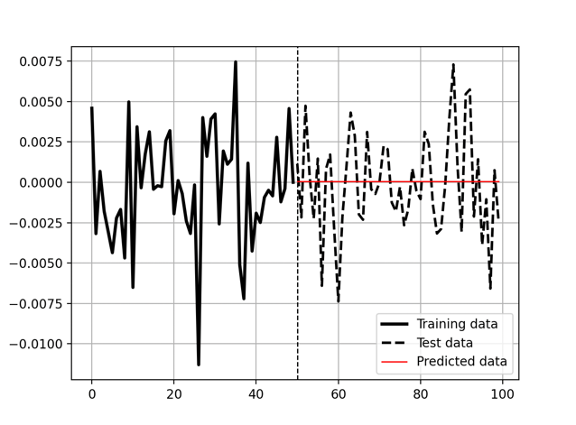


- 더미 회귀(dummy regression)는 다음 전략 중 하나를 인자로 받을 수 있다
  - `mean (평균)`
    - 항상 학습 데이터(y_train)의 평균을 예측
  - `median (중앙값)`
    - 항상 학습 데이터의 중앙값을 예측
  - `quantile (분위수)`
    - 분위수 매개변수와 함께 제공될 경우, 학습 데이터의 지정된 분위수를 예측
  - `constant (상수)`
    - 사용자가 제공한 일정한 값을 항상 예측

- 앞서 본 코드에서 선택된 전략은 **mean**
  - 더미 회귀 전략을 사용할 경우 모든 예측 값은 단순히 학습 데이터(y_train)의 평균이 됩니다.
  - 더미 회귀 한계
    - 머신러닝 모델이 아니라 **기준선**(benchmark)으로만 사용된다.(더미 회귀는 학습하지 않고 평균 같은 단순한 값만 예측하기 때문)


- 모델이 잘 작동하는지 어떻게 알 수 있을까
  - `성능 평가`는 트레이딩과 알고리즘 개발에서 매우 중요한 개념
  - `성능 평가`를 통해 올바른 모델을 선택하고 실제 환경에 적용
- **성능 평가** 방법 크게 두 가지
  - `모델 평가` (Model Evaluation)
    - 알고리즘이 **예측을 얼마나 잘하는지 평가**
  - `트레이딩 평가`(Trading Evaluation)
    - 그 알고리즘을 사용해서 실제 매매했을 때 **금융 성과를 평가**

#### 모델 평가에서 자주 쓰는 지표
- **정확도(Accuracy)**
  - 공식 : 정확도(Accuracy) = (정확하게 맞춘 예측 수) ÷ (전체 예측 수) × 100
    - 예를 들어, 작년에 100번의 예측을 했고 그중 73번이 맞았다면, 정확도는 73%
  - `상승` 또는 `하락` **방향을 예측**
  - 금융권에서는 정확도를 **히트 비율(hit ratio)** 이라고도 한다.
- **예측의 정확도**는 예측값(y_predicted)이 실제값(y_test)과 얼마나 가까운지로도 평가 ==> **손실 함수(loss function) 사용**
- **손실 함수**(loss function)
  - 정의 : 예측값과 실제값 사이의 차이를 수학적으로 계산하는 함수
  1. **평균 절대 오차**(Mean Absolute Error, MAE)
     - `가장 기본적인 손실 함수` 
     - `MAE`는 **예측값과 실제값의 절대 차이들의 평균을 계산**
       - 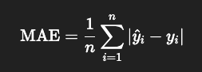  
       - MAE는 예측값과 실제값 사이의 평균적인 거리(절대값 차이)를 나타내며, **MAE 값이 작을수록 모델의 예측이 더 정확하다는 의미**
  2. **평균 제곱 오차**(Mean Squared Error, MSE)
     - `MSE`는 **예측값과 실제값의 차이를 제곱하여 평균한 값** ==> 회귀 문제에서 자주 사용
     - MAE와 마찬가지로, **MSE가 낮을수록 모델이 더 정확하다는 의미** ==> but MSE는 오차를 제곱하기 때문에, **큰 오차에 더 민감**하게 반응한다.
     - 하지만, MSE는 제곱된 단위를 가지기 때문에 해석이 직관적이지 않을 수 있음. ==> 이를 해결 위해, RMSE(Root Mean Squared Error, 평균 제곱근 오차) 나옴
     - `RMSE`는 **MSE의 제곱근을 취함**으로써, 원래 목표 변수와 같은 단위로 되돌려 준다.
       - `RMSE`는 **예측값이 실제값으로부터 얼마나 떨어져 있는지를 측정** ==> 표준편차(standard deviation) 와 동등한 개념

> Note
> - 데이터에 극단적인 값이 포함되어 있거나, 오차의 절대적인 크기가 중요할 때는 **MAE를 사용하는 것이 적절**
> - 모델의 성능을 더 민감하게 개선하고 싶을 때 주로 **MSE를 사용하는 것이 적절**
>   - 모델의 정밀한 조정(tuning)을 원할 때는 MSE가 더 유용

- MAE, MSE, RMSE 같은 지표는 **낮을수록 좋다.**
  - MAE: 평균 절대 오차 (예측이 얼마나 벗어났는지 평균적으로)
  - MSE: 평균 제곱 오차 (큰 오차에 더 큰 패널티)
  - RMSE: MSE의 제곱근 (단위가 원래 값과 같아짐)
- `숫자가 낮을수록 예측이 정확`하다는 뜻, 하지만 이 수치 하나만으로 모델의 좋고 나쁨을 판단하기는 어렵다.
  - **비교 대상**(베이스라인)이 있어야 의미가 생긴다.
- 여러 모델을 비교하여, **수용 가능한 오차 기준**(threshold)을 정해서 그 기준을 넘는 모델은 탈락시킨다. 
- 모델의 **편향**(Bias)도 살펴봐야 한다
  - 예측 모델이 한 방향(예: 매수)만 많이 예측하는 경우, `편향된 모델`
  - 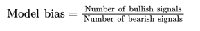
    - 어떤 모델이 올해 934개의 매수 포지션(long)과 899개의 매도 포지션(short)을 가졌다면, 모델 편향 지표는 1.038이며, 이는 허용 가능한 수준
    - 모델 편향이 0.0이라는 것은 매수 신호가 전혀 없었다는 뜻 (매도 없으면 → 0으로 나누기 → 편향 값 정의 불가)

- 수익성 지표
  - **순수익(Net Return)**: 수수료 등을 뺀 `최종 이익`을 의미
    - 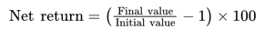
  - **이익 계수(Profit Factor)**
    - Profit Factor = 총 이익 / 총 손실
      - 1.00보다 크면 → 수익성 있는 전략
      - 1.00보다 작으면 → 손실 나는 전략
  - **개별 거래(individual trades)**
    - 거래당 평균 수익(Average Gain per Trade): 과거 데이터 기반으로, `수익이 난 거래들의 평균 이익`
    - 거래당 평균 손실(Average Loss per Trade): 과거 데이터 기반으로, `손실이 난 거래들의 평균 손해`
    - 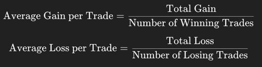
  - **위험(Risk)**
    - 최대 낙폭(Maximum Drawdown) : 투자 자산이나 포트폴리오의 가치가 최고점에서 최저점까지 얼마나 많이 하락했는지를 나타내는 지표
      - 이 지표는 자산이 `얼마나 크게 손실될 수 있는지를 보여주는 지표`
      - **하방 위험**(Downside Risk)을 평가할 때 자주 사용
      - 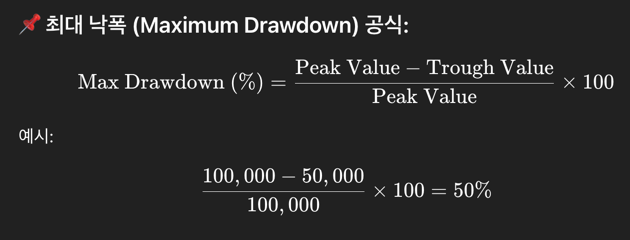
  - **샤프 비율(Sharpe Ratio)**
    - 위험을 얼마나 잘 감수하고 수익을 냈는지 보여주는 지표
      - 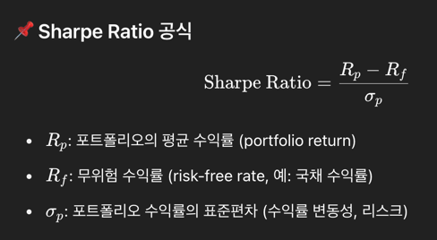
    - **샤프 비율 > 1.0**, 수익이 리스크보다 크다 = **좋은 전략**
    - **샤프 비율 < 1.0**, 리스크 대비 수익이 적다 = **비효율적 전략**
    - **샤프 비율 = 0**, 초과 수익 없음
    - **음수**, 무위험 수익률보다 못함 = **손실 전략**
#### 샤프비율 예시


  | 항목                  | 값                                             | 설명 |
| ------------------- |-----------------------------------------------| -- |
| **포트폴리오 수익률 (12%)** | 1년 동안 투자해서 총 **12% 수익**을 냈다는 뜻함.              |    |
| **무위험 수익률 (2%)**    | 아무런 위험 없이 얻을 수 있는 수익률. 예: **국채**나 **예금 이자율**. |    |
| **수익률 표준편차 (10%)**  | 이건 수익률의 변동성(위험도)를 뜻함. 숫자가 클수록 수익이 들쭉날쭉하다는 의미  |    |
- 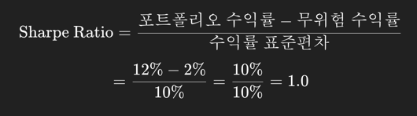

> **리스크 프리 레이트 (Risk-Free Rate)**
> - 전혀 위험이 없는 투자에서 얻을 수 있는 이론적인 수익률
> - 다른 위험이 있는 투자들의 수익률을 평가할 때 **기준점(벤치마크) 역할**

- EUR-USD 모델 결과
  - 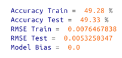
  - 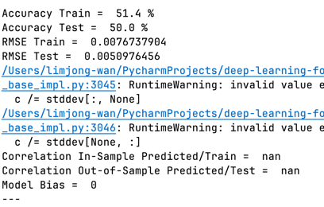
  - **모델 편향(bias)이 0.0**이라는 것은, 이 모델이 `더미 회귀 모델(dummy regression model)`임을 뜻함
  - 여기서 편향(bias)이 0.0이라는 뜻은, 모델의 예측값이 **모두 하락(bearish) 방향임을 의미**

> **NOTE**
> - **적절한 백테스트**(backtest)를 위해서는 데이터를 반드시 **훈련 세트**(training set)와 테스트 **세트**(test set)로 나누어야 한다.
>   - 훈련 세트(training set)
>     - x_train: 예측에 사용될 독립 변수(입력값)
>     - y_train: 예측하려는 목표 변수(정답값)
>   - 테스트 세트(test set) : x_test로 예측을 수행, y_test 와 비교
>     - x_test: 모델이 한 번도 본 적 없는 입력값
>     - y_test: 그에 대한 실제 정답
> - 모델 학습(Fitting)
>   - 알고리즘이 **x_train**, **y_train**을 바탕으로 학습하는 과정
> - 모델 예측(Predicting)
>   - 학습한 모델이 **x_test**를 바탕으로 예측을 수행하는 과정
> - **알고리즘의 주요 목표**
>   - **높은 정확도(accuracy)** && **안정적이고 변동성이 낮은 수익률**을 달성

## Machine Learning Models
- 각 머신러닝 모델의 `강점`과 `약점`을 이해하는 것이 중요하다.
  - 예측 작업의 특성에 따라 **어떤 모델을 선택해야 할지 알 수 있기 때문**이다.

### Linear Regression (선형 회귀)
- **선형 회귀 알고리즘**
  - `목표`
    - **예측값과 실제값 사이의 제곱 오차의 합(Sum of Squared Differences)을 최소화하는 최적의 직선(line)을 찾는 것**
  - `최적화 기법`
    - 가장 많이 사용되는 방법은 **최소제곱법**(Ordinary Least Squares, OLS) 
    - 오차의 제곱합이 가장 작아지도록 **직선의 계수**(coefficient)를 조정
  - `학습 과정`
    - OLS를 이용해 학습 데이터로부터 독립 변수의 **최적 계수들을 계산**
    - 이 계수는 직선의 **기울기(slope)와 절편(intercept) 역할** ??
  - `최종 모델`
    - 예측값은 다음과 같은 선형 함수로 표현
    - 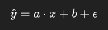
    - 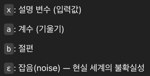
      - 이 함수는 입력 변수들에 가중치를 곱한 값에 절편과 오차를 더해,**예측값**(예: 기대 수익)을 계산 ?? 

---
#### 1. 선형 회귀 도식
````yaml
[입력 데이터 X, Y]
   |
   v
[최소제곱법 (OLS)]
   → 예측값과 실제값의 오차²의 합을 최소화
   |
   v
[기울기 a, 절편 b 계산]
   |
   v
[선형 함수 생성]
   y = a * x + b + noise
   |
   v
[새로운 x 값으로 y 예측]
````
> 주어진 데이터에 가장 잘 맞는 직선을 그려서, 새로운 입력이 들어오면 해당 직선 위의 y값을 예측하는 구조
  
#### 2. 예시로 보는 선형 회귀
📊문제: 기온에 따라 아이스크림 판매량이 어떻게 변할까?

| 기온(℃) | 아이스크림 판매량(개) |
| ----- | ------------ |
| 20    | 100          |
| 22    | 120          |
| 25    | 150          |
| 27    | 170          |
| 30    | 200          |

🔍 선형 회귀의 역할
- 이런 데이터를 보고 선형 회귀는 다음과 같은 직선을 찾는다.
  - `판매량 = 5*기온+0`
    - 여기서 5는 기울기 → 기온이 1도 오르면, 판매량은 5개 증가
    - 0은 절편 → 단순화를 위해 여기선 0이라고 가정

❓ 예측해보기
- 기온이 28도일 때 아이스크림은 몇 개 팔릴까?
  - `판매량 = 5*28+0=140`
- 예측 결과: 약 140개 팔릴 것이라고 예측

> **선형 회귀**는 데이터의 흐름을 직선으로 잡아, **새로운 값이 들어왔을 때 결과를 예측**
---


✅ **제곱 오차의 합**이란?  
🎯 `목표`
- **직선이 데이터에 얼마나 잘 맞는지를 판단하는 기준**이 필요
- 그 기준이 바로 **오차의 제곱합**(Sum of Squared Errors)

📌 `오차(Error)`란?  
- 실제값 y가 있고, 우리가 만든 직선은 예측값(y`)
- 오차 = 실제값 - 예측값(즉, 점이 직선에서 얼마나 떨어져 있는지)

📌 `오차의 제곱합`이란?  
- 모든 데이터에 대해 오차를 각각 제곱해서 전부 더한 값
  - 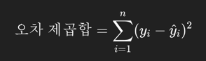
- **이 값을 줄이는 게 선형 회귀의 목적** -> 이 값이 작을수록 직선이 데이터에 잘 맞는다는 뜻

✅ **최소제곱법**(OLS)이란?
- `오차의 제곱합이 가장 작아지는 기울기(a)와 절편(b)`를 **수학적으로 계산**하는 방법
  - 쉽게, 직선을 어떻게 그려야 오차가 가장 작을까? -> **수학적으로 푸는 방법이 바로 OLS**

🔍 아주 쉬운 예시
📊 데이터

| 공부시간(x) | 점수(y) |
| ------- | ----- |
| 1시간     | 50점   |
| 2시간     | 60점   |
| 3시간     | 70점   |

✅ 어떤 직선을 그릴까?
- y=a⋅x+b
  - 직선 후보 1 : y=10x+40
  - 직선 후보 2 : y=20x+30
- **OLS** 를 통해 가장 적합한 후보를 찾으면 된다.
---
✅ 예제) OLS 공식  

| 공부시간(x) | 점수(y) |
| ------- | ----- |
| 1시간     | 2점    |
| 2시간     | 4점    |
| 3시간     | 6점    |

- 1단계 : 먼저 평균을 구한다.
  - x 평균(𝑥̄`)= (1 + 2 + 3) ÷ 3 = 2
  - y 평균(y`) = (2 + 4 + 6) ÷ 3 = 4
- 2단계 : 기울기공식 
  - 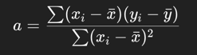
  - (각 x가 평균에서 얼마나 떨어져있나) × (각 y가 평균에서 얼마나 떨어져있나) 를 다 더한 값 나누기
  - 각 x가 평균에서 얼마나 떨어져있나의 제곱을 다 더한 값
- 3단계: 계산

| i | $x_i$ | $y_i$ | $x_i - \bar{x}$ | $y_i - \bar{y}$ | 곱하기 $(x_i - \bar{x})(y_i - \bar{y})$ | 제곱 $(x_i - \bar{x})^2$ |
| - | ----- | ----- | --------------- | --------------- | ------------------------------------ | ---------------------- |
| 1 | 1     | 2     | 1 - 2 = -1      | 2 - 4 = -2      | (-1) × (-2) = 2                      | (-1)² = 1              |
| 2 | 2     | 4     | 2 - 2 = 0       | 4 - 4 = 0       | 0 × 0 = 0                            | 0² = 0                 |
| 3 | 3     | 6     | 3 - 2 = 1       | 6 - 4 = 2       | 1 × 2 = 2                            | 1² = 1                 |

- 4단계: 각 열을 모두 더하기
  - 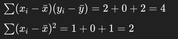
- 5단계: 기울기 계산
  - `a = 4/2` **= 2**
- 6단계: 절편(b) 계산!
  - b = y`- a*x' = 4 -2*2 **= 0**

> **최종모델**
> - **y' = 2x+0**
---

✅ **선형 회귀 요약**
- `목표`: 데이터를 가장 잘 설명하는 **직선**(선형 함수)을 찾는 것
- `수식` : y' = ax + b
  - a: 기울기 (x가 1 늘 때 y가 얼마나 늘어나는지)
  - b: 절편 (x = 0일 때 y는 얼마인지)
- `손실 함수`
  - 예측값과 실제값 사이의 오차를 구하고, 그 **오차를 제곱해서 모두 더한 값**(제곱 오차의 합)을 최소화
- `최적화 기법`
  - **최소제곱법**(OLS)를 사용해, **기울기**(a)와 **절편**(b)을 수학적으로 계산


---
- 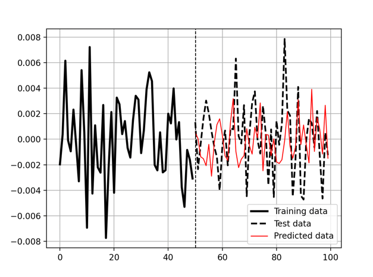
- 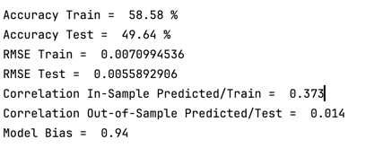
````text
Accuracy Train =  58.58 %
Accuracy Test =  49.64 %
→ 학습 데이터에선 58% 정도 예측이 맞았지만, 테스트 데이터에선 50%도 안 되는 정확도
→ 테스트셋 성능이 낮아, 일반화 능력이 부족함, 과거 데이터엔 어느 정도 맞지만, 미래(테스트셋)엔 거의 맞지 않음

RMSE Train =  0.0070994536 (평균 제곱근 오차)
RMSE Test =  0.0055892906
→ 예측값과 실제값의 차이(오차)의 평균 크기
→ 숫자가 작을수록 좋음
→ 절대 오차 자체는 크게 나쁘지 않음, 하지만 정확도와 상관관계를 함께 보면, 모델이 실제 방향성을 잘 못 잡고 있음


Correlation In-Sample Predicted/Train =  0.373
Correlation Out-of-Sample Predicted/Test =  0.014
→ 예측값과 실제값의 방향성 일치 정도 (1이면 완벽하게 같은 방향, 0이면 무관)
→ 학습셋에선 그럭저럭 양의 상관관계 있음
→ 테스트셋에선 거의 상관관계 없음 ==> 모델이 미래 데이터의 패턴을 전혀 못 따라감

Model Bias =  0.94
→ Long 시그널 비율 / 전체 시그널 수
→ 1.0이면 전부 Long, 0.0이면 전부 Short, 0.5면 균형
→ 여기서는 0.94 → 예측이 거의 Long(매수) 쪽에 치우쳐 있음

````
📌 모델은 계속 최적화하고 튜닝하는 대상. 최적화 과정에는 다음과 같은 여러 기법이 포함 될 수 있다.
1. 예측 변수(predictors) 선택이 매우 중요하다
   - 이 장에서는 과거 수익률(lagged returns) 을 예측 변수로 사용했음
   - 예측 변수는 경제적, 통계적 직관에 따라 선택 (자기 기준에 맞춰)
     - 금 가격 변동이 S&P 500 지수 변동을 설명하는 데 도움이 될 수 있음. 
     - 기술적 지표(technical indicators)를 예측 변수로 사용
2. 데이터 분할(train-test split)이 중요하다
   - 모델 성능 평가를 위해 학습 데이터와 테스트 데이터를 적절히 나누는 것이 매우 중요
   - 보통 **20% 테스트 / 80% 학습** 또는 **30% 테스트 / 70% 학습** 비율이 자주 사용.
3. 정규화(Regularization) 기법으로 편향 방지
   - 선형 회귀에서는 `릿지 회귀(Ridge Regression)` 와 `라쏘 회귀(Lasso Regression)` 같은 **정규화 방법을 사용**
   - **릿지 회귀:**
     - OLS(최소제곱법) 함수에 패널티 항을 추가하여, 큰 계수(coefficient)가 너무 커지는 것을 막는다.
     - 계수(기울기) 값이 너무 크지 않도록, `패널티를 통해 보정` 해주는 것.
   - **라쏘 회귀:**
     - 계수를 아예 0으로 만들 수 있어서, 특징 선택(feature selection) 효과도 낸다.
     - 일부 변수의 계수를 0으로 만들어버려서, 그 **변수는 모델에서 사실상 제외**

- **자기회귀 모델(autoregressive model)**
  - `종속 변수`(예측하려는 값)가 외부 데이터(exogenous data)가 아니라, `자신의 과거 값들에 의존해서 예측`
- **다중 선형 회귀 모델(multiple linear regression model)**
  - 매 시점마다 500개의 서로 다른 변수들(그리고 그에 해당하는 계수들)을 사용해 다음 값을 예측
- **단순 선형 회귀 모델(simple linear regression model)**
  -  단 하나의 독립 변수만을 사용해 종속 변수를 예측


> **선형 회귀의 장점**
> - 구현이 간단하고 학습시키기 쉽다. 
> - 메모리를 많이 차지하지 않는다.
> - 데이터 간에 선형적인 관계가 있을 때는 좋은 성능을 보인다.

> **선형 회귀의 단점**
> - 이상치(outlier)에 민감
> - 편향(bias)이 쉽게 생길 수 있다.
> - 데이터가 서로 독립적이라는 비현실적인 가정을 전제로 한다.

- 일부 **선형 회귀 모델은 데이터를 변환**(transform)하지 않는다.
  - 이런 경우, 예측 정확도가 매우 높고, 예측값이 실제값과 거의 똑같이 보일 수 있습니다.
  - 하지만 실제로는, 예측이 한 시점 뒤처져 있는(lag) 경우가 많습니다.
  - 즉, **각 시점의 예측값이 단순히 그 이전 시점의 실제값**일 뿐

#### 선형 회귀와 비정상 시계열 데이터의 문제점
- 비정상 시계열 데이터 + 선형 회귀 = 예측 실패 위험 높음
- 데이터 전처리(차분 등) 없이 쓰면 예측값이 의미 없이 마지막 값 복사가 됨
- 반드시 데이터를 정규화/변환하고 모델을 설계해야 진짜 예측이 가능함

📌 선형 회귀가 제대로 작동하지 않는 이유들
1. 예측력이 부족함 (Lack of Predictive Power)
 - 선형 회귀는 독립 변수와 종속 변수 사이의 선형 관계가 있다고 가정함.
 - 데이터가 비정상적이거나 선형 관계가 약하다면, 모델은 의미 있는 패턴을 잡지 못하고 순진한 예측(naive forecasting) 만 진행
2. 후행 지표만 사용하는 문제 (Lagging Indicators)
   - 금융 시장 가격은 자동상관(autocorrelation)이 강해서 **현재 가격이 이전 가격과 매우 유사한 경향**이 있음.
   - 그래서 모델이 단순히 이전 값만 예측하게 될 위험이 큼.

3. 특징 엔지니어링 부족 (Lack of Feature Engineering)
   - 선형 회귀 모델은 입력한 특성(피처)에 의존함.
   - 연된 값(lagged values)만 넣고, 금리, 거래량, 기술 지표 등 다른 관련 변수를 포함하지 않으면, **모델은 더 풍부한 예측을 하지 못함.**
4. 모델 자체가 단순함 (Model Complexity) 
   - 선형 회귀는 구조가 단순해서, 데이터 내에 있는 **복잡한 비선형 관계나 패턴을 잡지 못할 수 있음** 

### Support Vector Regression (서포트 벡터 머신)
- SVR
  - 머신러닝 기법의 한 종류
  - 예측할 값이 `숫자(연속형)`일 때 사용하는 **회귀용 알고리즘**
🔧 SVR의 작동 방식 요약
1. 기본 목표
  - 일반적인 회귀는 실제 값과 예측 값 사이의 오차를 최소화 - 어떤 숫자(연속된 값)를 예측하는 문제를 회귀 라고함
  - SVR은 대부분의 데이터가 들어가는 `ε(엡실론)이라는 마진 구간` 안에 예측이 들어가도록 하는 `최적의 경계(하이퍼플레인)`를 찾는 게 목적
> 너무 정확히 맞추려고 하기보다, 어느 정도 오차는 괜찮다고 보고, 그 안에 최대한 많이 맞추는 전략
2. 고차원 공간으로 보내기 (커널 트릭)
  - 현실 데이터는 직선(선형)으로 나누기 어려운 경우가 많음.
  - 그래서 **커널 함수**(Kernel Function)를 이용해 데이터를 고차원 공간으로 변형(매핑)
> 그렇게 하면 비선형 관계도 선형처럼 다룰 수 있게된다.

🧠 SVR의 핵심 개념
- **Epsilon-tube (ε-튜브)**
  - 예측값이 실제값과 어느 정도 차이나도 괜찮은 허용 구간. => 이 범위 안에 예측값이 들어가도록 만드는 것이 목표
  - 튜브 밖으로 나간 점들에 대해서는 오차를 최소화하도록 최적화 문제를 푼다. => 주로 쓰는 손실 함수는 **MSE (평균제곱오차)**
- **커널 함수**
  - 데이터를 고차원으로 보낼 때 쓰는 함수
  - 어떤 커널을 사용할지는 데이터의 특성과 문제의 종류에 따라 달라진다.
    - 선형 커널 (Linear) : 데이터가 선형적인 경우
    - 다항식 커널 (Polynomial) : 곡선처럼 휘어진 패턴이 있을 때
    - RBF (Radial Basis Function) : 비선형 데이터에 매우 자주 사용됨 => 제일 흔함
    - 시그모이드 커널 (Sigmoid) : 뉴런처럼 동작하는 형태

> Note
> - RBF 커널은 SVR에서 자주 쓰이는 인기 있는 커널
>   - 그 이유는 비선형 관계를 효과적으로 포착할 수 있기 때문
>   - 구체적인 형태에 대한 사전 지식이 없을 때 적합
> - RBF 커널은 입력 공간에서 특징 벡터들 간의 거리를 기반으로 유사도를 계산
>   - 감마(gamma)라는 파라미터가 사용되며, 이 감마는 각 학습 데이터가 모델에 미치는 영향력을 결정
>   - 감마 값이 클수록 모델은 개별 데이터 포인트에 더 집중하게 되어 잠재적으로 오류가 발생할 수 있다.

- **SVR**은 노이즈나 이상치가 있어도 `데이터의 패턴을 잘 잡아내는 강력한 회귀 기법`
- **비선형 관계를 다룰 때 특히 효과적**

````python
model = make_pipeline(StandardScaler(), SVR(kernel = 'rbf', C = 1, gamma = 0.04, epsilon = 0.01))
````
- **비선형 관계**
  - 입력 값(x)이 변할 때 출력 값(y)이 직선 형태로 변하지 않는 관계
- **규제 강도를 넣는 이유**
  - 규제 강도는 모델이 훈련 데이터에 너무 집착하지 않도록 제어해서, 새로운 데이터에도 잘 작동하도록 도와주는 안전장치.
- **어느 정도가 적당할까?**
  - `gamma`: 작게 시작해서 조금씩 키워보는 것이 좋음. 예: 0.01 → 0.04 → 0.1
    - | gamma 값                | 손전등 빛의 범위 | 의미                   | 결과                       |
      | ---------------------- | --------- | -------------------- | ------------------------ |
      | **작은 gamma (예: 0.01)** | 넓게 퍼짐     | **멀리 있는 점들까지 함께 고려** | 예측이 **부드럽고 일반적** (덜 민감함) |
      | **큰 gamma (예: 1.0)**   | 좁고 강하게 퍼짐 | **아주 가까운 점만 고려**     | 예측이 **날카롭고 복잡** (너무 민감함) |

  - `epsilon`: 데이터에 노이즈가 많으면 0.05 ~ 0.1, 정밀도가 중요하면 0.001 ~ 0.01

---

| 파라미터           | 의미                                                     |
| -------------- | ------------------------------------------------------ |
| `kernel='rbf'` | RBF(방사 기저 함수) 커널 사용. **비선형 관계**를 잘 포착                  |
| `C=1`          | 규제 강도. **오차에 얼마나 민감할지** 정함. (크면 과적합 위험, 작으면 일반화 잘됨)    |
| `gamma=0.04`   | 커널의 영향 범위. **작으면 부드럽게**, **크면 개별 점에 예민**함              |
| `epsilon=0.01` | 오차 허용 범위 (ε-tube). 이 안의 오차는 **무시**함. 작을수록 더 정밀하게 맞추려 함 |


- 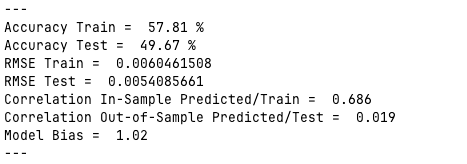
````text
Accuracy Train = 57.81%
> 학습 데이터에서 모델의 예측 정확도가 약 57.8%라는 뜻이에요. 학습 데이터에서는 어느 정도 맞추고 있다는 의미

Accuracy Test = 49.67%
> 테스트 데이터(새로운 데이터)에서는 정확도가 약 49.7%로 떨어짐. 
> 즉, 실제로 새 데이터를 맞추는 성능은 학습 때보다 낮음

RMSE Train = 0.0060
> 학습 데이터에서 예측값과 실제값 사이의 평균 제곱근 오차가 작다는 뜻
> 숫자가 작을수록 예측이 실제에 가깝다는 의미.

RMSE Test = 0.0054
> 테스트 데이터에서도 오차가 약간 더 작게 나옴
> RMSE 기준으로는 학습과 테스트 성능 차이가 크지 않음

Correlation In-Sample Predicted/Train = 0.686
> 학습 데이터에서 예측값과 실제값의 상관관계가 0.686으로 비교적 높은 편
> 선형 관계가 어느 정도 포착됐다는 의미

Correlation Out-of-Sample Predicted/Test = 0.019
> 테스트 데이터에서는 예측값과 실제값의 상관관계가 거의 0에 가까워서, 새 데이터에선 예측이 거의 무작위 수준임을 보여줌.
> 모델이 테스트 데이터에 대해 거의 아무런 패턴도 포착하지 못했고, 예측값이 실제 결과와 상관이 없다는 뜻.

Model Bias = 1.02
> 모델 편향이 거의 1에 가까워서, 롱(상승)과 숏(하락) 신호가 균형을 이룬 상태임을 나타냄
````
#### SVR의 장점과 단점
- 장점:
  - 특징(feature)이 많고 복잡한 데이터셋에서도 잘 작동하며, 고차원 공간에서도 성능이 좋다.
  - 커널 함수를 사용해 입력 변수와 목표 변수 간의 비선형 관계도 잘 포착한다.
  - epsilon-튜브라는 방식을 사용해 이상치(outlier)에 강건하다. 
    - 대부분 데이터에 맞추면서 이상치의 영향을 줄인다.
- 단점:
  - 최적 성능을 위해 여러 하이퍼파라미터를 조정해야 하는데, 적절한 값을 찾기가 어렵고 시간이 많이 걸릴 수 있다.
  - 복잡한 커널을 쓰거나 데이터가 클 경우 계산 비용이 많이 든다.
  - 하이퍼파라미터 선택에 민감해서 잘못 설정하면 모델 성능이 크게 떨어질 수 있다.

---
### SVR 실습
#### 🧠 결과적으로 보여주는 것
🔵 파란 점: 실제 데이터
🔴 빨간 선: SVR 예측 직선
⚫ 검정 점선: ε-tube 범위 (무시되는 오차 영역)


- 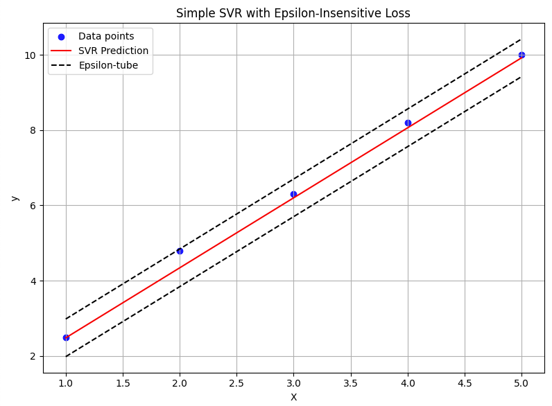
````python
"""
ε-튜브 안에 있는 오차는 무시.
바깥에 있는 경우만 가중치를 업데이트하기 위한 gradient를 계산.

error > ε: 예측이 실제보다 너무 크면, 가중치와 절편을 감소시키는 방향으로 업데이트
error < -ε: 예측이 실제보다 너무 작으면, 가중치와 절편을 증가시키는 방향으로 업데이트
-ε ≤ error ≤ ε: 오차가 허용범위 안이라 업데이트하지 않음 (gradient = 0)
"""
if error > self.epsilon: # 튜브 밖 윗부분
    grad_w = x_i
    grad_b = 1
elif error < -self.epsilon: # 튜브 밖 아랫 부분
    grad_w = -x_i
    grad_b = -1
else:
    grad_w = 0
    grad_b = 0

````
| 이름        | 설명                  | 클수록 효과           |
| --------- | ------------------- | ---------------- |
| `epsilon` | 무시할 수 있는 오차 범위 (튜브) | 모델이 덜 민감함        |
| `lr`      | 학습률 (가중치 업데이트 폭)    | 더 빠르게(위험하게) 학습   |
| `C`       | 오차에 대한 패널티 강도       | 오차를 더 강하게 줄이려고 함 |
| `epochs`  | 전체 반복 학습 횟수         | 더 오랫동안 학습        |


---
### Stochastic Gradient Descent Regression (확률적 경사 하강법 회귀)
- **Gradient descent**는 모델의 `비용 함수(또는 손실 함수)를 최소화`하기 위해 사용되는 일반적인 **최적화 알고리즘**
  - **Gradient descent**는 여러 가지 최적화 방법의 기본이 되는 핵심 개념

> NOTE (참고)
> - Gradient는 단순히 어떤 표면의 기울기나 경사를 의미.
> - 표면 위에서 **가장 낮은 지점**(최솟값)에 도달하려면, 경사를 따라 내려가야 한다.
>   - `가장 낮은 지점` ? 
>     - 오차의 총합(= 손실 함수, loss function)을 최소화하는 것, 👉 오차가 가장 작아지는 모델을 찾는 것
>     - **함수의 값이 가장 작아지는 지점 = 최적의 모델 파라미터**
 

- **Stochastic Gradient Descent** (SGD)는 머신러닝 모델, 특히 `회귀 모델을 훈련시키는데 자주 사용되는 반복 최적화 알고리즘`
  - 특히 데이터가 많거나 온라인 학습 상황(`데이터가 계속 들어오는 상황`)에 적합
  - SGD는 `선형 회귀 모델 중 하나`인데, **최적의 직선을 찾기 위해** 확률적 경사 하강법을 사용하는 방법
  - 일반적인 최소제곱법(OLS, Ordinary Least Squares)과 달리, **SGD**는 모델 파라미터를 한 번에 다 업데이트하는 게 아니라 **반복적으로 조금씩 업데이트**
    - 데이터가 아주 많을 때도, `데이터 전체를 한꺼번에 다 쓰지 않고도 학습할 수 있다.`
    - 이 무작위 선택은 **학습 과정에 다양성**을 주고, **지역 최적해(local optima)에 빠지는 것을 방지**하는 역할

- **Gradient Descent**(GD)와 **Stochastic Gradient Descent**(SGD)의 차이는 `모델 파라미터를 업데이트하는 방식`
  - `GD`는 **전체 데이터를 한꺼번에** 사용해 업데이트
  - `SGD`는 **일부 데이터만 사용**해 반복적으로 업데이트

> Note
> - SGD(확률적 경사 하강법)는 특정 머신러닝 모델 종류에 속하는 게 아니라, 본질적으로 **최적화 방법(알고리즘)**
> - SGD 자체는 모델이 아니라, 다양한 머신러닝 모델을 학습시킬 때 **최적의 답(모델 파라미터)을 찾기 위해 사용하는 최적화 기법**

- **GD(경사 하강법)**
  - 전체 학습 데이터셋을 한 번에 사용해 기울기(gradient)를 계산하고, `한 에포크(epoch, 전체 데이터 한 바퀴)마다` 모델 파라미터를 한 번 업데이트
  - GD는 느리지만 수렴하는 과정이 부드럽고 안정적
- **SGD(확률적 경사 하강법)**
  - 한 개의 `학습 샘플`이나 `작은 미니 배치`(mini batch)를 사용해 기울기를 계산하고, 훨씬 자주 파라미터를 업데이트
  - SGD는 더 빠르지만 업데이트가 불규칙해서(진동이 심할 수 있음) 수렴 과정이 다소 불안정
  - SGD는 또한 지역 최솟값(local minima)에 빠질 위험이 적어 더 견고함.
    - `지역 최솟값(local minima)` : 함수의 그래프에서 주변 점들 중에서 가장 낮은 값을 가진 지점

> GD와 SGD 중 어느 걸 쓸지는 문제의 특성, 데이터 크기, 계산 속도와 수렴 안정성 간의 균형에 따라 결정

- 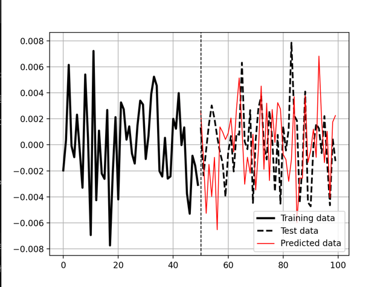
  - 빨간 선과 검은 점선이 어느 정도 비슷한 흐름을 보이긴 하지만, 몇 군데는 예측이 빗나간 부분이 많음.
  - 패턴은 어느 정도 따라가지만, 상관관계나 정확도 면에서는 성능이 그리 좋지 않아 보임.
  - 상관관계가 거의 0에 가까웠기 때문에, 예측이 거의 무작위처럼 보이는 부분도 있음.
- 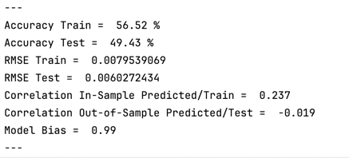


- **SGD의 장점**
  - `큰 데이터셋에 강하다`
    - 전체 데이터를 한꺼번에 쓰지 않고, 작은 부분(개별 데이터나 미니 배치)으로 조금씩 모델을 업데이트해서 효율적
  - `지역 최솟값(local minima)에서 벗어날 수 있다`
    - 무작위성이 있어서 최적해를 더 잘 찾을 수 있다.
  - `일반화 성능 향상`
    - 매번 다른 데이터 샘플로 학습하기 때문에 과적합(overfitting)을 줄여 더 좋은 예측 성능을 낼 수 있다.
    - **과적합(overfitting)?** : 모델이 학습 데이터에 너무 딱 맞춰져서, 새로운 데이터(시험 데이터 등)를 제대로 예측하지 못하는 상황
- **SGD의 단점**
  - `수렴 과정이 불안정하고 요동칠 수 있다`
    - 다른 최적화 알고리즘에 비해 결과가 덜 안정적이고, 최적값 주변에서 계속 흔들릴 수 있어서 느리게 수렴할 수 있다.
  - `특성(피처) 스케일링에 민감하다`
    - 입력 데이터의 크기나 범위에 영향을 많이 받기 때문에, 데이터를 적절히 **정규화하거나 표준화하는 작업이 꼭 필요**하다.
    - **특성(Feature)**
      - 모델에 입력으로 들어가는 변수나 데이터의 각 항목을 의미.
      - 예) 집값 예측 모델에서 ‘집 크기’, ‘방 개수’, ‘지역’ 등이 모두 특성이야.
    - **스케일링(Scaling)**
      - 각각의 특성들이 가진 값의 범위나 단위가 너무 다르면 학습이 어려워서, 데이터를 일정한 범위(예: 0~1)나 평균 0, 분산 1로 맞춰주는 작업.

### Nearest Neighbors Regression(최근접 이웃 회귀)
- k-최근접 이웃 회귀(K-Nearest Neighbors Regression, KNN 회귀) 라고도 불리는 비모수적(nonparametric) 알고리즘
  - `비모수적`
    - 고정된 모양(형태)의 수학적 모델을 가정하지 않는 방법
  - `모수적 (Parametric) 모델`
    - 예: y = ax + b 같은 형태를 가정
- KNN은 회귀 문제(regression task)에 사용된다.
- 입력 데이터와 가장 가까운 k개의 이웃을 찾아서, 이웃들의 값을 평균 내어 예측하는 회귀 방법

| 항목          | 설명                                                           |
| ----------- | ------------------------------------------------------------ |
| **정의**      | 입력 데이터와 가장 가까운 **k개의 이웃**을 찾아서, 이웃들의 **값을 평균 내어 예측**하는 회귀 방법 |
| **비모수적 모델** | 모델의 형태나 수식이 정해져 있지 않고, **학습 없이 데이터 자체를 저장**해두었다가 예측 시 사용     |
| **하이퍼파라미터** | `k` 값 (몇 개의 이웃을 볼지)                                          |
| **장점**      | - 구현이 간단함<br>- 데이터가 많을수록 정밀한 예측 가능                           |
| **단점**      | - 데이터가 많아질수록 계산이 느림<br>- 고차원 데이터에서는 성능 저하<br>- 이상치에 민감할 수 있음 |

> **NOTE**
> - k 값이 클수록 더 많은 이웃들을 참고해서 평균을 내므로, 결과가 부드럽고 안정적((극단적인 값 하나에 휘둘리지 않음)
> - k 값이 작을수록 주변 몇 개 이웃만 보게 되니까 작은 변화나 패턴도 잘 포착하지만, **노이즈**(잡음)에 쉽게 영향을 받음
> - **적절한 k를 고르는 것이 중요** => **k가 작으면 민감, 크면 안정**

- `KNN 회귀`는 새로운 값을 예측할 때, 기존 데이터 중에서 **가까운 이웃들의 값을 참고하는 방식**
  - **거리 계산이 핵심**(`얼마나 비슷한지`를 판단하는 기준)
  - **자주 쓰는 거리 계산법**
    - `유클리드 거리`: 직선 거리
    - `맨해튼 거리`: 가로세로로만 이동한 거리
    - `민코프스키 거리`: 일반화된 거리 계산법

- KNN 회귀를 시계열 예측에 사용할 때, 이웃의 개수(k)를 얼마나 설정할지는 `데이터의 특성`과 `원하는 예측 정확도`에 따라 달라진다.
  - 정해진 정답은 없고, **보통은 실험과 검증(예: 교차검증)을 통해 결정**한다.
- ⚖️ 핵심 개념: Bias-Variance Trade-off (편향-분산 균형)
 - **작은 k** → 낮은 편향 (local pattern 잘 잡음), 높은 분산 (불안정)
 - **큰 k** → 높은 편향 (단순한 예측), 낮은 분산 (안정적이지만 유연성 부족)

> **Note**
> - 시계열 데이터에서는 시간적인 특성(temporal aspect)을 반드시 고려해야 한다.
> - 추세가 뚜렷하고 느리게 변하는 데이터 → k 크게
> - 변화가 빠르고 민감한 데이터 → k 작게

#### 🔹 데이터셋 크기와 k 값의 선택
- `데이터셋이 작을 경우`:
  - 작은 k 값을 선택하는 것이 **과적합(overfitting)을 피하는** 데 도움이 됨.
- `데이터셋이 클 경우`:
  - 더 큰 k 값을 사용해도 일반화 성능을 유지할 수 있음.

#### ✅ **KNN (K-Nearest Neighbors) 회귀의 장점**
1. **비선형성**
- KNN은 선형 모델이 아니므로, 복잡한 패턴을 잘 포착할 수 있음.
- 특히 금융 데이터처럼 **비선형적인 움직임을 보이는 경우 유리함**.

2. **유연한 적응력**
- KNN은 **인스턴스 기반 학습**(instance-based learning)이라, **새로운 데이터가 들어와도 모델을 다시 학습시킬 필요 없음.**
  - 금융 시장처럼 계속 변하는 환경에 적합.

3. **직관적인 해석 가능**
- 예측 결과가 가장 가까운 k개의 이웃에 기반하므로, 복잡한 모델보다 이해하고 설명하기 쉬움.

#### ❌ KNN의 단점:
1. 차원이 높은 데이터에서 성능 저하
- 금융 데이터는 보통 여러 변수(예: 기술적 지표, 다른 자산 수익률 등)를 포함.
- 차원이 높아지면 가까운 이웃을 찾기 어려워짐
  - **고차원?**: 특성(feature)의 수가 많다는 뜻

2. 계산 비용이 큼
- 데이터셋이 커질수록 모든 거리 계산이 필요하므로, 예측 시간이 매우 느려질 수 있음.

3. 노이즈와 이상치에 민감
- 모든 이웃을 동등하게 고려하므로, **이상치(outlier)가 포함될 경우 예측에 악영향**을 줄 수 있음.


---
### KNN 실습
#### 🧠 결과적으로 보여주는 것
🔵 파란 점: 실제 관측된 데이터(훈련 데이터)들
🔴 빨간 선: 빨간색 선 (KNN Prediction, k=2), k-NN 회귀 모델이 예측한 값들

````python
  for x in X_test:
      # 거리 계산 (유클리디안 거리)
      # 유클리디안 거리 = 절대값
      distances = np.abs(self.X_train - x)

      # 가까운 K개 인덱스
      #argsort()[:k]
      k_indices = distances.argsort()[:self.k]

      # K개의 타깃 평균
      k_avg = np.mean(self.y_train[k_indices])
      predictions.append(k_avg)

````

- 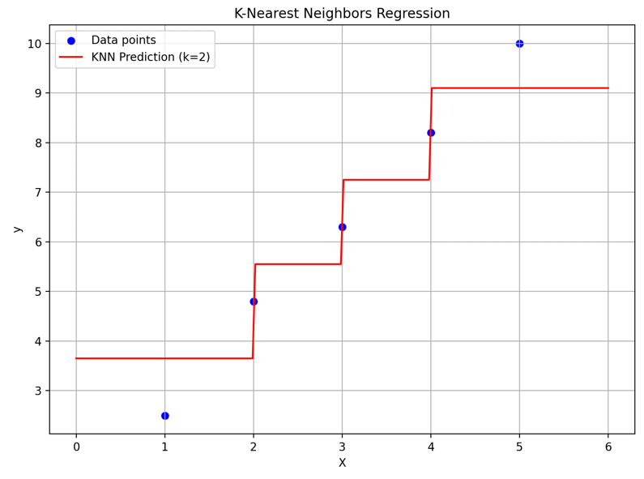

### Decision Tree Regression(결정 트리 회귀)
#### 🎯 의사결정나무(Decision Tree)
- `계층적인 순서도(flowchart)` 처럼 구성된다.
- **특성(feature)** 값에 따라 여러 선택이나 결정을 시각적으로 표현한 그래프 형태의 구조
- **질문(조건)을 단계적으로 하면서 예측값을 찾는 구조**
  - ex) 이 사람은 키가 170cm 이상인가요? → `네` → 몸무게는 70kg 이상인가요? → `아니오` → 그럼 예측값은 65kg!

#### 📊 구조
- **루트(root)**: 제일 위에 있는 첫 질문 (예: "키가 170 이상인가요?")
- **노드(node)**: 질문이 있는 지점
- **가지(branch)**: 질문에 따라 나뉘는 결과 (예: "네" → 오른쪽, "아니오" → 왼쪽)
- **잎(leaf)**: 최종 예측 결과 (예: 몸무게 = 65kg)

#### 💡 질문 방식
- 나무의 **루트(root)에서** 모든 입력 특성들 중에서 **데이터를 가장 잘 구분할 수 있는 특성을 선택**
- 선택된 특성에 따라 **결정 노드**를 만들고, 그 특성의 가능한 값들에 따라 **데이터를 나눔**
- 나눠진 각 하위 데이터 집합에 대해 남아 있는 특성들을 고려하며 이 과정을 **재귀적으로 반복**

#### 🛑 중단 조건
- **최대 깊이에 도달**했을 때
- 노드에 포함된 샘플 수가 `최소값`보다 **작아**졌을 때
- 더 이상 불순도나 **정보 이득 개선이 없을 때**

> Note
> - **random_state**는 무작위성을 포함한 알고리즘에서 무작위의 초기값을 고정하기 위해 사용하는 매개변수
> - random_state를 파라미터로 전달함으로, 매번 같은 결과를 얻을 수 있어서, 다른 알고리즘이나 하이퍼파라미터를 공정하게 비교할 수 있음.
> - 예를 들어: 모델의 초기 가중치(weight)를 랜덤하게 설정, 데이터를 무작위로 섞어서 훈련, 또는 훈련 데이터를 무작위로 나눠서(train/test split) 쓰기도 함. 
>   - 이럴 때 매번 실행할 때마다 결과가 달라질 수 있음 

> **random_state 고정**
> - 모델 재현성(reproducibility) 확보
> - 디버깅, 성능 비교, 보고서 작성 시 결과가 매번 달라지면 안 되니까
> - 동일한 데이터와 하이퍼파라미터 조건에서 항상 같은 결과를 얻을 수 있게 해 줌


> 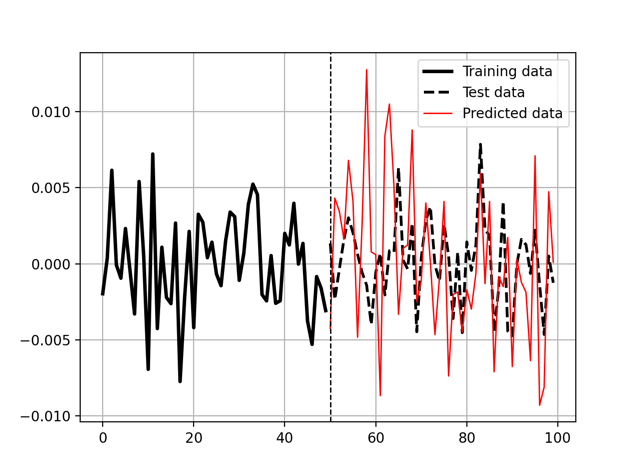
> 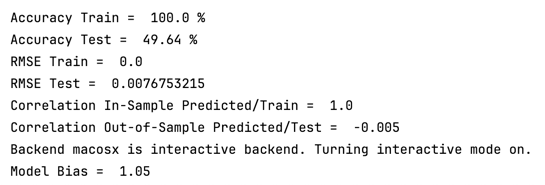

#### ✅ 결정 트리의 장점:
1. 전처리를 거의 안 해도 됨
   - 다른 머신러닝 모델은 데이터를 숫자로 바꾸거나 정규화 같은 작업
   - 결정 트리는 `질문`을 만들어서 데이터를 나누는 방식
2. 결측값(missing values)이 있어도 괜찮음
   - 없는 값에 대해서도 유연하다.
3. **비선형 관계**나 **변수 간 상호작용**을 잘 포착
   - 조건이 섞여 있는 복잡한 관계들이 많음
     - 단순한 선형 관계로 표현할 수 없는 것들이 있음.
   - 결정 트리는 이런 조건을 쉽게 잡아냅

#### ❌ 결정 트리의 단점:
1. 데이터에 아주 민감해서, 작은 변화에도 모델이 확 바뀔 수 있고, **정규화**(regularization)를 잘하지 않으면 과적합되기 쉽다.
   - 훈련 데이터에는 엄청 잘 맞는데, 새 데이터에는 성능이 안 좋을 수 있음. ==> **과적합**
2. 복잡한 관계를 모델링하려면 깊은 트리가 필요하기 때문에 한계가 있다.
   -  트리가 너무 복잡하면, 오히려 **노이즈**(데이터의 우연한 패턴)까지 학습 ==> 잘못된 결과 도출


---
### Decision Tree Regression 실습
🎯 목표
- 입력값 X, 출력값 y가 있을 때
- 데이터를 분할하면서 **최소한의 평균 제곱 오차**(MSE)가 되도록, 트리를 재귀적으로 구성
> 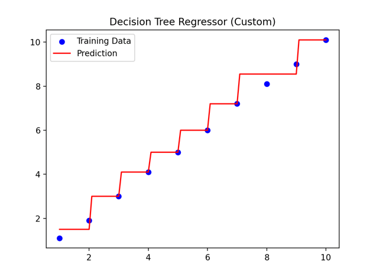
> 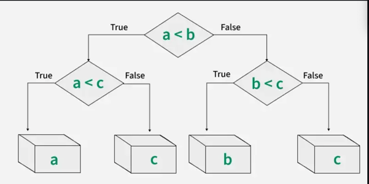
### Random Forest Regression(랜덤 포레스트 회귀)
#### 🌲 랜덤 포레스트 회귀(Random Forest Regression)
- 여러 개의 **의사결정나무**(Decision Tree)를 조합해 하나의 예측값을 도출하는 **머신러닝 알고리즘**
- `앙상블 학습(Ensemble Learning)` 중 하나로, 개별 모델(트리)들의 결과를 모아 더 정확한 예측을 수행
- **과적합**(overfitting)에 강하고, 복잡한 데이터에도 잘 작동
- 랜덤 포레스트(Random Forest)는 다음 두 가지 기법을 결합
  - Bagging (Bootstrap Aggregating): 데이터를 중복 허용해 무작위 샘플링 → 여러 학습기 생성
  - Randomized Tree Splitting: 각 결정 트리에서 노드를 분할할 때 특성을 무작위로 선택

#### ⚙️ 작동 원리
- 각각의 트리는 서로 다른 데이터와 특성 조합으로 만들어짐
- `트리들의 예측값을 평균`(회귀의 경우) 내어 최종 결과를 산출
- `여러 개의 결정 트리`를 **조합**하여 강한 모델을 만드는 구조

#### 🧰 핵심 구성 요소
- **결정 트리(Decision Tree)** : 기본 구성 단위, 예측을 수행하는 나무 구조
- **앙상블(Ensemble)** : `여러 트리의 결과를 조합`
- **배깅(Bagging, Bootstrap Aggregating)** : **중복 허용** `무작위 샘플링`으로 여러 학습용 데이터 생성
  - **각 트리는 서로 다른 데이터로 학습**

#### 🔁 트리 생성 과정
- **부트스트랩 샘플링** 
  - 원본 데이터에서 중복 허용하며 무작위로 샘플을 추출 → 여러 학습용 데이터셋 생성
- **결정 트리 훈련**
  - 각 샘플마다 트리 하나씩 생성
  - 각 노드에서 일부 특성만 무작위로 선택해서 분기 결정 (→ 다양성 증가)
- **예측 결과 조합**
  - 각 트리의 예측값을 모아 평균값을 사용 (회귀 문제일 경우)

> 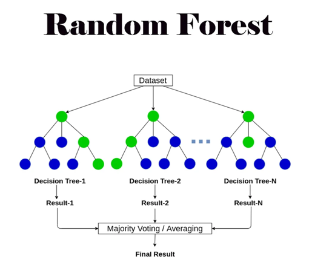

#### ✅ 장점
- **높은 예측 정확도**
  - 여러 결정 트리를 결합하는 앙상블 방식 덕분에 일반적으로 데이터에 대해 정확한 예측을 보여줌.
- 금융 시계열 같은 **노이즈가 많고 경계가 불분명한 데이터에도 강함**
  - 시계열 데이터가 매우 노이즈가 많고 거의 무작위적일 때도, 결과를 최적화하는 데 유리함.
- **노이즈와 이상치에 대한 강건성(robustness)**
  - 여러 트리의 예측값을 평균 내기 때문에 노이즈나 이상치의 영향을 덜 받음.

#### ❌ 단점
- 모델 해석이 어려움 
  - 많은 수의 트리를 사용하기 때문에, 최종 결정과 개별 트리의 의사결정 과정을 직관적으로 이해하기 어려움.
- **학습 시간이 오래 걸림** 
  - 트리 수가 많아질수록 학습에 필요한 계산량이 증가하여, 모델 학습 과정이 느려질 수 있음.

> 예제, 안돌아감.
> 

### AdaBoost Regression(AdaBoost 회귀 : 적응형 부스팅)
#### 💡 배경 개념 – Boosting이란?
- **그래디언트 부스팅(Gradient Boosting)**
  - 약한 학습기(weak learner)를 `개선`하여 모델을 만드는 기법
  - 약한 학습기의 약한 부분(weak spots)을 타겟으로 삼아, 그 부분을 잘 처리할 수 있는 **다른 약한 학습기들을 계속 추가**함으로써 **전체 성능을 높이려는 접근 방식**
- 이런 방식에서 파생된 알고리즘이 바로 `Adaptive Boosting`, 줄여서 AdaBoost
  - 여러 **약한 학습기**(weak learner)를 모아 **강한 모델**(strong learner)을 만드는 방법

#### 🧠 AdaBoost란?
- 오답에 집중해서 새로운 학습기를 계속 추가해나감

#### ⚙️ 작동 방식 요약
- **가장 단순한 결정 트리****(스텀프)로 시작
- 잘못 예측한 데이터에 더 많은 `가중치(weight)를 부여`
- 새 모델은 이전 모델이 `틀린 부분을 잘 예측하도록 학습`
- 모든 모델의 **결과를 조합**(투표 or 가중 평균)해서 최종 예측

#### Gradient Boosting 요약
- 약한 예측 모델들(주로 결정 트리)을 순차적으로(하나씩 차례대로) 구성한다.
- 각 후속 모델은 **이전 모델들의 오차**(또는 잔차)를 `보정`하기 위해 만들어진다. 
  - 이 때 **그래디언트 하강법**(gradient descent)을 사용해, 전체 오차가 줄어들도록 조정한다.
- **최종 예측**은 모든 모델의 예측을 학습률(learning rate)에 따라 가중 평균 또는 합산하여 계산한다.


#### ✅ AdaBoost의 장점
- **일반적으로 정확도가 높다** 
  - `약한 학습기들을 조합`해가며 예측 성능을 점점 높이기 때문에, 성능이 괜찮은 모델을 만들 수 있음.

- **이해하기 쉽다**
  - 알고리즘이 비교적 간단하며, 직관적으로 학습 흐름을 파악할 수 있음.
  - **오답에 집중 → 가중치 조정 → 학습 반복**

#### ❌ AdaBoost의 단점
- **이상치(outlier)에 민감**, 노이즈에 약하다
  - 잘못된 데이터나 극단적인 값이 있으면, 해당 `샘플에 과도하게 가중치가 부여되어 모델이 왜곡`될 수 있음

- **속도가 느리고 최적화가 덜 되어 있다**
  - 각 `학습기를 순차적으로 반복해서 학습`하기 때문에, 학습 시간이 오래 걸리고 병렬 처리가 어려움

#### 실습
````python
````

### XGBoost Regression
#### ✅ XGBoost 회귀
- `XGBoost`
  - **Extreme Gradient Boosting**의 줄임말
  - 성능이 뛰어난 그래디언트 부스팅 결정 트리(GDBT) 알고리즘

#### 작동 원리 요약
- **기본 모델**(보통 결정 트리)로 시작
- 목적 함수(objective function) 정의
- **경사 하강법**을 이용해 예측 오차를 줄이도록 모델 개선
- 새로운 결정 트리를 앙상블에 추가해, **이전 모델들이 만든 오차를 보정**
- **정규화 기법**(학습률, 컬럼 서브샘플링 등)으로 과적합 방지
  - 학습률
  - 컬럼 서브샘플링
- 모든 트리의 예측값을 합쳐서 최종 예측값 도출
> 파이썬에서 사용시 : pip install xgboost

## Overfitting and Underfitting
- 머신러닝 기반의 예측 분석을 하다 보면 **여러 문제**가 생긴다. 
- 데이터 사이언스(그리고 금융)에서 `완벽`이라는 말은 **존재하지 않는다.**
- `가장 중요한 문제`는 **모델이 데이터를 얼마나 잘 맞추는가**(Fitting)이다.
- `오버피팅`과 `언더피팅` 개념을 잘 이해 해야 실제 모델링 에서 **문제를 피할 수 있다.**

#### 🧠 관련 개념
| 개념                | 의미                              | 영향 받는 범위 |
| ----------------- | ------------------------------- | -------- |
| **편향 (Bias)**     | 모델이 **얼마나 단순해서 기본적인 패턴을 놓치는가?** | 학습 데이터   |
| **분산 (Variance)** | 모델이 **훈련 데이터에 얼마나 민감하게 반응하는가?** | 테스트 데이터  |


- **🎯 편향(Bias)** 
  - `예측`이 일관되게 `실제 값과 얼마나 멀리 떨어져 있는지`를 의미
    - **저편향(low bias)**
      - 모델이 훈련 데이터의 복잡한 패턴을 잘 따라가는 경우 
      - 즉, `학습 데이터를 잘 맞추는 경우` 
    - **고편향(high bias)**
      - 모델이 너무 단순해서 `기본적인 패턴도 잘 못 학습함`

- **🎯 분산(Variance)**
  - 훈련 데이터가 조금만 바뀌어도 `예측 결과가 크게 달라지는 정도를 의미`
    - **고분산(high variance)**
      - 모델이 **훈련 데이터에 지나치게 민감**하게 반응 
      - 즉, 훈련 데이터에 너무 잘 맞춰서 `노이즈까지 학습` 
      - 테스트 데이터에서는 성능이 급격히 떨어짐 => **오버피팅**
    - **저분산(low variance)**
      - 훈련 데이터가 달라져도 예측 결과가 **안정적**
      - 일반화는 잘 되지만, 학습 데이터 자체를 잘 못 맞추면 의미 없음 => **언더피팅**

### 📌 1. 오버피팅 (Overfitting)
- **오버피팅 이란?** 
  - `학습 데이터`에서는 **매우 좋은 성능**, `테스트 데이터`에서는 **나쁜 성능**
  - 학습 데이터의 세부 사항뿐만 아니라, **노이즈까지 학습**해버린 상황
  - `고분산`(high variance), `저편향`(low bias) 모델에서 발생
    - ex) 학습은 잘 했는데, 테스트 데이터에서 안맞음

#### 🔧 오버피팅을 방지하는 방법
- `모델 복잡도를 적절하게 조정` => **편향과 분산 사이의 균형(Bias-Variance Tradeoff) 유지**
- `정규화(Regularization) 기법`→ **모델 복잡도를 제어**하고 과적합 방지

#### ⚠️ 오버피팅이 발생하는 주요 원인
| 원인                  | 설명                                   |
| ------------------- | ------------------------------------ |
| **데이터 부족**          | 학습 데이터가 적거나 다양성이 부족하면 모델이 그에 과하게 맞춰짐 |
| **과도하게 복잡한 모델**     | 너무 복잡하면 데이터의 노이즈까지 학습함               |
| **과도한 피처 사용**       | 불필요한 피처까지 학습하면 일반화가 떨어짐              |
| **정규화 부족**          | 제약 없이 학습하면 과하게 적합함                   |
| **데이터 누수(Leakage)** | 테스트 데이터 정보가 훈련에 포함되면 성능이 과대평가됨       |


### 📌 2. 언더피팅 (Underfitting)
- **언더피팅 이란?**
  - `모델이 너무 단순`해서 데이터의 **기본 패턴조차 학습하지 못한 경우**
    - `고편향`(high bias), `저분산`(low variance) 모델에서 발생 
      - 학습 데이터 + 시험 데이터에 모두 다 안맞음 
  - 학습이 덜 되었거나, 모델이 지나치게 단순한 경우에 발생

#### ⚠️ 언더피팅이 발생하는 주요 원인
| 원인                 | 설명                                        |
| ------------------ | ----------------------------------------- |
| **모델 복잡도 부족**      | 너무 단순해서 비선형 관계 등 복잡한 패턴을 못 잡음 (ex: 선형 회귀) |
| **학습 부족**          | 데이터나 반복 횟수가 부족해서 충분히 학습되지 않음              |
| **과도한 정규화**        | 정규화를 너무 강하게 하면 모델이 너무 단순해짐                |
| **불충분하거나 부적절한 피처** | 의미 있는 정보를 가진 피처가 적거나 없으면 학습이 잘 안 됨        |

#### 🔁Bias-Variance Tradeoff
| 상태       | 설명                                      |
| -------- | --------------------------------------- |
| **오버피팅** | 학습 데이터에 너무 맞춰서 테스트 성능이 떨어짐<br>고분산 / 저편향 |
| **언더피팅** | 너무 단순해서 학습 자체가 잘 안 됨<br>고편향 / 저분산       |

> **좋은 모델**은 `적절한 복잡도`를 가지고, 학습 데이터에도 잘 맞고 **새로운 데이터에도 일반화**가 잘 되는 모델

#### ✅ 가장 이상적인 모델은 저편향+저분산 
| 편향 | 분산 | 학습 데이터 | 테스트 데이터 | 상태            | 문제점              |
| -- | -- | ------ | ------- | ------------- |------------------|
| 높음 | 낮음 | 못 맞춤   | 못 맞춤    | **언더피팅**      | 과거, 미래 예측 모두 부정확 |
| 낮음 | 높음 | 잘 맞춤   | 못 맞춤    | **오버피팅**      | 미래 예측에 잘못된 신뢰 생성 |
| 낮음 | 낮음 | 잘 맞춤   | 잘 맞춤    | **이상적인 모델** ✅ | 예측 성능 안정적, 실용적   |

- 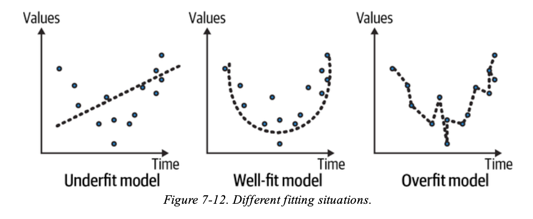  
- **언더피팅(Underfit)된 모델**
  - 과거 값도 미래 값도 예측을 잘하지 못한다.
- **적절히 피팅된(well-fit) 모델**
  - 전반적인 `경향성(패턴)을 잘 포착`
  - 전체적인 시간 구간에 걸쳐 **예측이 안정적**
- **오버피팅(Overfit)된 모델**
  - 과거 데이터를 지나치게 세부적으로 학습
  - `노이즈`나 `일시적 이상치`까지도 학습 => **미래에 대한 잘못된 예측**

#### 피팅편향을 줄이기 위한, 백테스트 모범사례 적용 
- 시계열 예측을 위한 머신러닝 모델을 만들 때, **과거 데이터를 완벽히 맞추도록 파라미터를 과하게 조정하지 않도록** 주의
- **피팅 편향**(fitting bias, 과적합)을 줄이기 위해, 다음과 같은 **백테스트 시의 모범 사례**(best practices)를 적용
---
- **📈 훈련 데이터 증가**
  - 데이터 내의 다양한 패턴과 변동성을 더 폭넓게 학습할 수 있어, `오버피팅 가능성을 줄일 수 있다.`
- **🎯 특징 선택 (Feature Selection)**
  - 관련성 있고 `유의미한 특성만 신중하게 선택`
  - `의미 없는 특성이나 중복된 특성 제거` → **노이즈와 복잡도 감소** → **일반화 능력 향상**
- **🧩 정규화 기법 (Regularization)**
  - `모델의 복잡도를 명시적으로 제어` → **오버피팅을 구조적으로 방지**
- **⚙️ 하이퍼파라미터 튜닝**
  - 모델의 하이퍼파라미터를 최적화
    - `하이퍼파라미터`는 **모델의 행동 방식과 복잡도를 제어**하는 역할
    - 적절한 조정은 성능 향상과 **과적합 방지에 매우 중요**
- **🤖 앙상블 기법 사용 (Ensemble Methods)**
  - 여러 모델의 예측을 결합, **개별 모델의 편향(bias)을 완화**하고 **일반화 능력을 향상**
- **🔍 정기적인 모델 평가**
  - 모델을 정기적으로 평가를통해, `모델의 일반화 성능을 모니터링` → 오버피팅이나 성능 저하의 신호를 감지

## Summary
**💡 핵심적으로 알아야 할 점**
- 과거의 데이터는 미래 결과를 반드시 보장하지 않는다.
- 백테스트(backtest)는 어느 정도 **편향**(bias)을 갖는다. => `머신러닝 모델을 과신하지 말고 현실적인 관점에서 평가하라`
  - 왜냐하면 결과를 맞추기 위해 많은 **튜닝**(tuning)을 하게 되기 때문
  - 이로 인해 **오버피팅**(overfitting)이 발생할 수 있다.
- 패턴은 분명히 존재하지만, 그 결과가 항상 동일하진 않다.
- `금융 시계열 예측을 위한 머신러닝은 끊임없이 진화 중`
- 대부분의 알고리즘은 **기본 상태**(default form)에서는 예측력이 떨어진다. 
  - 여러가지 모델을 적절히 조합하고, 리스크 관리 도구와 필터링 기법을 적용하면 지속 가능한(sustainable) 알고리즘을 만들어 전체 시스템의 가치를 높일 수 있다.