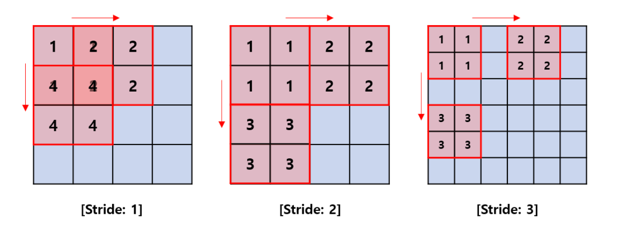
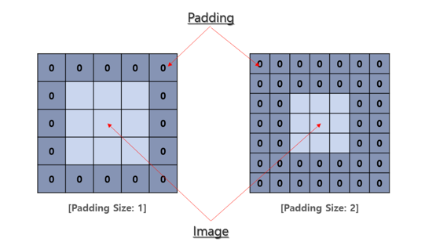

# Chapter 8. Deep Learning for Time Series Prediction I
- `딥러닝(Deep Learning)`은 머신러닝보다 약간 더 복잡하고 세부적인 분야
  - 머신러닝과 딥러닝은 모두 **데이터 과학**(Data Science)에 속한다.
- `딥러닝`은 대부분 **신경망(Neural Networks)에 관한 것**
  - `신경망`은 **매우 정교하고 강력한 알고리즘**
  - `신경망`은 **복잡하고 비선형적인 변수 간 관계도 잘 포착**할 수 있는 **강력한 도구**
## A Walk Through Neural Networks
- `인공신경망`(**ANN**: Artificial Neural Network)은 `신경과학`(Neurology) 연구에서 시작
  - `신경과학` 에서 인간의 뇌와 복잡하게 연결된 뉴런 네트워크가 어떻게 작동하는지를 이해하고자 했음
  - 이를 바탕으로 생물학적 신경망을 `컴퓨터적으로 모방`한 모델이 **인공신경망**

#### 🧠 인공신경망의 구조
- `인공신경망(ANN)`은 **노드**(=인공 뉴런)들이 **계층적으로 연결된 구조**
- 입력층 → 은닉층(1개 이상) → 출력층
  1. **입력층 (Input Layer)**
  - `데이터가 처음 입력되는 지점`
    - 수치형, 범주형, 센서 데이터 등 다양한 입력 가능

  2. **은닉층 (Hidden Layers)**
  - `입력 데이터를 처리`하는 계층 (1개 이상 가능)
  - 각 뉴런은 입력값을 받아 계산을 수행하고, `결과를 다음 계층에 전달`

  3. **출력층 (Output Layer)**
  - `마지막 예측 결과를 생성`
    - 문제 유형(분류/회귀 등)에 따라 뉴런의 개수와 출력 형태가 달라짐

- 
- **인공신경망**(ANN: Artificial Neural Network)의 간단한 예시
  - 2개의 입력 노드에서 시작, **4개의 은닉층**(hidden layers)을 거쳐 `계산`이 이루어짐
  - 최종적으로 **출력층**(output layer)에서 **가중 예측**(weighted prediction)을 출력

#### 🧠 각 뉴런(Neuron)의 주요 역할
- **가중 입력 계산**
  - `이전 층 또는 입력 데이터`로 부터 **입력값**(input)을 받음
  - 각 입력값은 **가중치(weight)와 곱해짐**
    - `가중치`는 해당 입력의 **중요도 또는 연결 강도를 의미**
    - 모든 가중 입력을 **합산**(sum)함
      - 은닉층의 각 뉴런이 이전 층의 모든 뉴런으로부터 입력을 받아서 그것들을 하나로 모아 계산
- **활성화 함수 적용 (Activation Function)**
  - 가중 합을 기반으로 비선형 함수를 적용함 
  - 이 과정을 통해 뉴런의 **출력값**(output)이 결정됨 
  - `활성화 함수`는 모델이 **비선형 패턴을 학습할 수 있게 해줌**

#### 🔁 학습 과정 (Training)
- `신경망`은 학습 중에 **가중치를 조정함으로써 성능을 향상**
  - 일반적으로 `경사하강법(gradient descent)` 같은 최적화 알고리즘을 사용
- **손실 함수**(loss function)를 통해 `모델의 예측 오류를 계산`
  - 손실 함수의 **기울기**(gradient)를 계산하여, **가중치를 오차를 줄이는 방향으로 업데이트**

> Note
> - Forward Propagation (순전파) 
>   - 입력 데이터를 입력층에 넣고 
>   - 각 은닉층을 거치며 가중치 × 입력값 + 편향 → 활성화 함수를 통해 계산
>   - 예측 결과를 출력하는 전체 흐름
> - Backpropagation (역전파)
>   - `오차를 거꾸로 전파(backpropagate)`하면서 **가중치를 업데이트**하는 알고리즘

### Activation Functions (활성화 함수)
- `활성화 함수`는 신경망에서 **뉴런의 출력에 비선형성을 부여**
  - **이를 통해 비선형적인 관계를 학습**

| 함수          | 출력 범위   | 중심   | 장점              | 단점               |
| ----------- | ------- | ---- | --------------- | ---------------- |
| **Sigmoid** | 0 \~ 1  | 0 아님 | 부드럽고 확률 해석 가능   | 기울기 소실, 0 중심 아님  |
| **tanh**    | -1 \~ 1 | 0    | 0 중심, 더 강한 비선형성 | 기울기 소실 (깊은 네트워크) |

#### 🔹 1. 시그모이드 함수 (Sigmoid Function)
- 
- 
- 📈 특징
  - 출력 범위: 0 ~ 1
  - step function의 부드러운 근사 
  - `이진 분류(binary classification)` or 어떤 함수나 데이터의 값을 부드러운 형태로 근사시키는 것(smooth approximation) 에 적합
- ✅ 장점 
  - 시그모이드 함수는 곡선이 연속적이고 부드러워 **미분 가능** 
    - **경사 하강법(gradient descent)에 유리** 
  - 출력이 확률처럼 해석 가능 (0~1 범위)
- ❌ 단점 
  - `기울기 소실(Vanishing Gradient) 문제`
    - 입력이 크거나 작을 경우 시그모이드의 출력은 0 또는 1 근처로 포화 
    - 해당 데이터를 미분시 `기울기가 0`에 가까워져 학습이 제대로 이루어지지 않는 문제가 발생
  - 출력이 0 중심이 아님 → 가중치 최적화 시 비대칭적인 업데이트가 발생(한쪽으로 치우쳐짐)

#### 🔹 2. 하이퍼볼릭 탄젠트 함수 (tanh)
- 
- 
- 📈 특징 
  - 출력 범위: -1 ~ 1 
  - 시그모이드 함수와 유사하지만, **0 중심(zero-centered)**
- ✅ 장점 
  - 출력이 0을 중심으로 대칭 → 가중치 업데이트 시 안정적 
  - **비선형성이 강해 복잡한 데이터 패턴을 더 잘 표현 가능**
- ❌ 단점 
  - `기울기 소실(Vanishing Gradient) 문제`
    - 입력값이 극단적으로 크거나 작을 경우 기울기가 0에 가까워짐

> 현대 딥러닝에서는 **ReLU**나 **Leaky ReLU** 같은 다른 함수들을 더 많이 사용

#### 🔹 3. ReLU 활성화 함수 (Rectified Linear Unit)
- 
  - 입력값이 양수이면 그대로 통과 
  - 음수이면 0으로 치환됩니다.
- 
- `ReLU(Rectified Linear Unit)` 함수는 아주 단순하지만, **딥러닝에서 가장 널리 쓰이는 활성화 함수**
- ✅ 장점
  - 간단한 구현과 빠른 연산 속도
    - 복잡한 연산 없이, `단순히 0과 입력값 중 큰 값을 선택하는 구조`라서 계산이 빠르고 효율적
    - 모델 학습 속도가 빠름
  - 기울기 소실(Vanishing Gradient) **문제 완화**
    - `ReLU의 기울기`는 입력이 양수일 때 항상 1, 깊은 네트워크에서도 학습이 잘 진행
- ❌ 단점 
  - 음수 입력에 대해 0 출력 → `정보 손실 가능성`
    - 뉴런이 완전히 죽어버릴(dead neuron)
  - 0에서 미분 불연속 → 최적화 이슈 가능성
    - 특정 상황에서는 **학습 불안정이 발생**

#### 4 3. Leaky ReLU 활성화 함수 (Rectified Linear Unit)
- `Leaky ReLU`는 ReLU 함수의 확장 버전
  - **입력값이 음수**일 때도 `아주 작은 기울기를 가지도록 설계`된 함수 
- 
-  
- ✅ 장점
  - 죽은 뉴런 문제 해결
    - Leaky ReLU는 음수 입력도 아주 작게 출력하므로, 뉴런이 죽지 않고 `미세하게라도 학습에 참여`
  - 전체 입력 구간에서 **기울기가 존재**
    - ReLU는 x=0에서 기울기가 끊기지만, Leaky ReLU는 음수 구간에도 기울기가 있어서 미분 가능한 연속 함수
- ❌ 단점
  - 음수 구간의 기울기(0.01 등)는 하이퍼파라미터 → 튜닝 필요
    - 이 값을 너무 작게 하면 ReLU와 차이 없음
    - 너무 크게 하면 음수 쪽으로 과도하게 학습

### Backpropagation (역전파)
- Backpropagation
  - 신경망을 학습시키기 위해 사용하는 핵심 알고리즘
  - Backward Propagation of Errors의 줄임말
  - **오차를 뒤로 전파하여 가중치를 조정하는 방식**

#### 🧠 전체 학습 과정 요약

1. **가중치와 편향 초기화**
- 신경망의 가중치(Weights)와 편향(Biases)을 무작위로 초기화
  - 학습이 반복되면서 점점 조정

2. **순전파 (Forward Propagation)**
- 각 뉴런:
  - **가중치 × 입력값 + 편향 → 활성화 함수 적용 → 다음 층으로 전달**

3. **손실 계산 (Loss Function)**
- 예측값과 실제값(정답)을 비교하여 **오차**(Loss)를 계산
  - 예: 회귀 문제에서는 MSE (Mean Squared Error) 사용

4. **역전파 (Backpropagation)**
- **출력층부터 입력층 방향으로 오차를 역으로 전달하며 기울기(gradient)를 계산**
- **체인 룰(Chain Rule)을 이용** - 체인 룰 : 여러 함수가 겹쳐져서 연결(composition) 되어 있을 때, 그 전체 함수의 미분값(기울기)을 계산하는 방법
  - 각 뉴런의 출력값에 대해 `손실이 얼마나 민감한지 계산`
    - 이를 바탕으로 가중치와 편향의 기울기(변화량)를 구함

5. **가중치와 편향 업데이트**
- 기울기 정보를 기반으로 가중치와 편향을 업데이트
- 편향도 마찬가지로 `학습률(learning rate)` 만큼 이동
- 이 때, 데이터를 여러 개씩 묶어 **batch 단위**로 처리

6. **에포크 반복 (Epochs)**
- 위의 과정을 **전체 데이터셋에 대해 여러 번 반복**
  - 1 Epoch = 전체 데이터를 한 번 다 학습한 것
- 일반적으로 수십~수천 번 반복하며 학습이 수렴되도록 함

7. **검증 (Validation / Test)**
- 학습이 끝나면, **보지 않았던 검증 데이터**로 성능을 측정
- 모델이 **과적합 없이 일반화**되었는지 평가

> NOTE
> - Learning Rate (학습률)
>   - 신경망의 가중치가 얼마나 빠르게 또는 천천히 업데이트될지를 결정하는 값
>     - 학습률이 크면: 더 빠르게 학습하지만 불안정할 수 있음
>     - 학습률이 작으면: 안정적으로 학습되지만 학습 속도 느림
> - Batch Size (배치 크기)
>   - 한 번의 학습 단계에서 몇 개의 데이터 샘플을 처리할지를 정하는 값
>     - 너무 작으면: 노이즈가 심하고 불안정 
>     - 너무 크면: 메모리 부담이 크고 학습 속도 저하

| 크기                        | 특징                                                                                         |
| ------------------------- | ------------------------------------------------------------------------------------------ |
| **작은 배치** (16, 32, 64)    | 자주 가중치를 업데이트함 → 빠르게 수렴할 수도 있음<br>다양한 데이터 반영 가능<br>하지만 기울기 계산에 **노이즈** 많음 → 수렴이 불안정할 수도 있음  |
| **큰 배치** (128, 256, 그 이상) | 더 **안정적인 기울기 계산**<br>병렬처리에 유리 → GPU 등에서 빠르게 학습 가능<br>하지만 메모리 많이 필요, 업데이트 빈도 낮아 수렴이 느릴 수 있음 |

#### Optimization Algorithms
- `신경망(Neural Networks)`에서는 최적화 알고리즘을 사용하여 학습 과정 중 **네트워크의 파라미터(가중치와 편향)를 업데이트**
- 최적화 알고리즘을 통해 **손실 함수(loss function)를 최소화**하고, 네트워크의 성능을 최대로 만드는 최적의 파라미터 값을 찾는 것이 목적

**[최적화 알고리즘(Optimizers)]**  
**1. 경사 하강법(Gradient Descent, GD)**
  - `기본적인 최적화 알고리즘`
  - 손실 함수의 **기울기**(gradient)에 대해 **반대 방향으로 가중치와 편향을 업데이트** => 최소 또는 최대값을 찾음.
  - **학습률(learning rate)을 곱한 만큼 이동**하면서 `파라미터를 조정`
    - 

**2. 확률적 경사 하강법(Stochastic Gradient Descent, SGD)**
  - SGD는 `경사 하강법의 변형`, 전체 데이터셋이 아니라 **임의로 선택한 하나의 훈련 샘플 또는 미니배치 (mini batch)를** 사용해 `기울기를 계산하고 파라미터를 업데이트` 한다.
  - 계산 효율성이 높고, 훈련 과정에서 노이즈가 발생하여 **지역 최적점(local optima)에서** 벗어나는 데 도움을 줄 수 있다.
    - 
    - 

**3. Adam (Adaptive Moment Estimation)** - Adam = RMSprop + Momentum
  - `Adam은 적응형 최적화 알고리즘`, 각 파라미터마다 **1차 및 2차 모멘트(평균과 분산에 해당)를 추정**하여 `적응형 학습률을 계산`한다.
    - **1차 모멘트**: 기울기(gradient)의 평균
      - `파라미터가 어느 방향으로 가야 할까?`를 파악
      - **이동의 방향을 결정하는 데 중요한 역할**
        - ex) 단기적으로 아래쪽으로 향하고 있어도, 과거에 위쪽으로 향하고 있다면 위쪽으로 향하도록
    - **2차 모멘트**: 기울기의 분산 또는 제곱 평균
      - `얼마나 불안정하게 튀고 있는가?`를 측정 
        - 특정 파라미터에 대한 기울기가 얼마나 자주 그리고 크게 변했는지를 측정하는 지표
      - **이동 크기(학습률) 결정**
  - Adam은 `다양한 상황에서 효율성과 성능이 뛰어나` 널리 사용된다.
  - **Adam =** `방향은 부드럽게 잡고 (Momentum)` + `불안정한 곳은 속도를 줄여서 이동 (RMSprop)` **=> 학습률을 매 순간 파라미터마다 다르게 조정**
  - 각 파라미터마다 **학습률을 다르게 적용** -> `가중치마다 얼마나 빠르게 움직일지를 조절`
  - 최근의 **그래디언트 정보를 누적해서 활용** -> `이전보다 지금 어디로 움직이면 좋을지 계산함`.


**4. RMSprop (Root Mean Square Propagation)**
  - RMSprop은 기본적인 `경사 하강법`의 **느린 수렴이나 진동 문제를 해결하기 위해 개발된 알고리즘**이다.
  - 최근의 **제곱 기울기(squared gradients)의 평균을 계산**하여 `각 파라미터에 대해 학습률을 조정`한다. **=> 학습률을 동적으로 계산**
  - **지수 가중 이동 평균(exponentially weighted moving average)을 사용**하여 `기울기의 크기를 조절`한다.
  - 변동이 큰 파라미터에는 학습률을 낮추고, 변동이 적은 곳은 높여서 조정
  - 각 파라미터마다 **학습률을 다르게 적용** -> `가중치마다 얼마나 빠르게 움직일지를 조절`
  - 최근의 **그래디언트 정보를 누적해서 활용** -> `이전보다 지금 어디로 움직이면 좋을지 계산함`.
- [그림 예시]
    
  - 곡선 (회색): 손실 함수 (Loss function), 우리가 줄이고 싶은 대상
  - 검은 점들: 현재 파라미터의 위치
  - 보라색 화살표: 파라미터가 업데이트된 방향과 거리 → 한 스텝당 이동량 
  - **어떤 화살표는 길고 어떤 화살표는 짧음 ➡ 이게 바로 RMSprop의 핵심: 상황에 따라 학습률을 조절해서 이동 크기를 다르게 한다**


> **최적의 옵티마이저를 선택하기 위해 지속적인 실험 & 튜닝은 필수이다.**


#### Regularization Techniques(정규화 기법)
- 신경망에서 `정규화 기법`은 **과적합을 방지하는 데 사용**되는 방법 
- `정규화 기법`은 **신경망의 복잡성을 제어**하고 보지 못한 **데이터에 대한 일반화 능력을 향상**시키는 데 도움이 된다.

---
  
- **드롭아웃(Dropout)**
  - `드롭아웃`은 **과적합을 방지하기 위해 신경망에서 흔히 사용되는 정규화 기법**
    - **신경망이 특정 부분에 너무 의존해서 생기는 문제를 막는 방법**
  - 이 기법은 `훈련 중에 특정 비율의 뉴런을 무작위로 생략(드롭)`하여 출력을 0으로 설정하는 방식으로 작동
    - **특정 비율을 뉴런을 훈련에서 배제**
    - 배제한 뉴런들러 인해 **나머지 뉴런들이 더 견고하고 독립적인 표현을 학습하도록 강제**
  - **각 뉴런의 개별 학습 능력을 향상**

- **조기 종료(Early Stopping)**
  - `과적합 방지 기법 중 하나`
  - `검증 세트`에 대한 **성능이 일정 기간 동안 더 이상 개선되지 않거나 오히려 악화되기 시작하는 시점을 포착**
    - 이 시점은 **모델이 훈련 데이터의 노이즈까지 학습**하여 `일반화 능력이 떨어지기 시작하는 과적합의 징후로 간주`
  - **훈련을 에포크(Epoch) 단위로 진행**하면서 `매 에포크마다 검증 세트 성능을 평가`
    - 검증 성능이 가장 좋았던 시점의 모델 상태를 기록 -> `검증 성능이 가장 좋았을 때 기록해 둔 모델을 사용`


#### Multilayer Perceptrons, MLP (다층 퍼셉트론)
- `퍼셉트론의 구성 요소 및 작동 방식`
  - 
    - **입력 (Inputs)** : 퍼셉트론이 받아들이는 여러 개의 정보 또는 데이터
    - **가중치 (Weights)** : 각 입력값에 곱해지는 중요도 또는 영향력을 나타내는 값
    - **가중 합 (Weighted Sum)** : 각 입력값(x)과 해당 가중치(w)를 곱한 값들을 모두 더한 것
    - **활성화 함수 (Activation Function)** : 가중 합의 결과를 받아 최종 출력을 결정하는 함수
    - **출력 (Output)** : 활성화 함수를 거쳐 나온 퍼셉트론의 최종 결과값
- `퍼셉트론`
  - **단일 계층 신경망**
  - **가장 기본적인 형태의 의사결정 단위**

- `다층 퍼셉트론(MLP)`
  - 여러 계층의 인공 뉴런, 즉 **노드로 구성된 인공 신경망(ANN)의 한 종류**
  - `MLP`는 **피드포워드 신경망** - 정보가 네트워크를 통해 `한 방향으로만 흐른다는 것을 의미`
  - `MLP`는 **역전파(backpropagation) 알고리즘을 사용**하여 훈련
    - `역전파`는 예측된 출력과 원하는 출력 사이의 차이(오차)를 최소화하기 위해 네트워크 내 **뉴런들의 가중치(weights)를 조정**
  - `MLP`는 **비선형적인 관계를 학습하는 능력이 뛰어남**
  - 
    - `1-2-3-4 한번의 반복`이 **1 epoch** 이다. => **오차가 줄어들때까지 진행**

````python
'''
은닉층 1: 20개 뉴런, ReLU
은닉층 2: 20개 뉴런, ReLU
출력층: 1개 뉴런 (다음 시점 수익률 예측)
'''
model = Sequential()

# 은닉층1
model.add(Dense(num_neurons_in_hidden_layers, input_dim = num_lags, activation = 'relu'))  
# 은닉층2
model.add(Dense(num_neurons_in_hidden_layers, activation = 'relu')) 

#출력층 1개
model.add(Dense(1))
'''
손실 함수: 평균 제곱 오차(MSE)
최적화 기법: Adam
'''
model.compile(loss = 'mean_squared_error', optimizer = 'adam')
````
- 모델 결과
  - 
- 하이퍼파라미터가 민감하게 결과에 영향을 준다.
- 특징 선택, 모델 구조, 정규화, 앙상블 등 다양한 방법을 통해 모델 성능을 개선해야 한다.
- 훈련 중에는 손실 값이 점점 감소해야 학습이 잘 되고 있다는 신호이다.
  - 

#### Recurrent Neural Networks
- RNN(Recurrent Neural Network, 재귀 신경망)
  - `순차적인 데이터` 또는 `시간에 따라 변하는 데이터(시계열 데이터)`를 처리하도록 설계된 **신경망의 한 종류**
  - 일반적인 신경망은 입력에서 출력(피드포워딩)으로 한 번만 처리하지만, **RNN**은 `이전의 정보를 기억하면서 다음 입력을 처리`
  - RNN의 핵심 특징은 **순환 연결(recurrent connections)**
    - RNN은 자신의 출력을 다음 입력에 연결하는 루프 구조를 가지고 있어서, **이전 정보를 기억하고 반영하며 데이터를 처리**할 수 있다.
    - 순환 연결(Recurrent connections) 덕분에 RNN은 시퀀스(순차적 데이터) 안의 의존성과 패턴을 포착
  - RNN은 `이전 입력의 맥락(context)`을 **기억**해서 **시계열 데이터나 문장**처럼 **순서가 중요한 데이터를 잘 처리**
      - 네트워크 안에 **루프(loop)**를 만들며, 이 루프를 통해 시간이 흐름에 따라 정보를 기억하고 유지할 수 있게
- `전통적인 RNN`은 **기울기 소실 문제**(vanishing gradient problem)라는 한계
  - 역전파(backpropagation)를 통해 순환 연결을 거슬러 기울기를 전달할 때,
  - 그 값이 너무 작아지거나 너무 커져서, **신경망을 제대로 학습시키기 어려워지는 현상**
- 
- 책 예제
  - 

> 💡 TIP
> - **다양한 하이퍼파라미터를 반복적으로 실험**하면서 최적의 조합을 찾거나, 최적화 함수를 만드는 것이 좋음.
> - 다양한 시간 구간(time horizon)을 대상으로 **백테스트를 해보는 것도 좋은 방법**

**[요약]**  
- RNN은 **내부 메모리**(internal memory)를 유지하고 **시간적인 의존성**(temporal dependencies)을 포착함으로써 **순차적인 데이터**(sequential data)를 처리할 수 있는 신경망
  - RNN은 `시계열 데이터`나 `순차 데이터`와 관련된 작업에서 강력한 성능을 발휘
- MLP 와 동일한 최적화알고리즘을 사용 가능하다.

**[RNN활용]**
- 
#### 🔁 1. Many-to-One
- **여러 개의 입력 시퀀스 → 하나의 출력**
  - 설명: 여러 시점의 데이터를 받아서, 그 전체에 대한 하나의 판단을 내리는 구조 
  - 대표적인 활용 예시:
    - 시계열 예측: 과거 며칠간의 주가 → 다음 날의 주가 예측 
    - 감정 분석: 문장 전체를 보고 긍정/부정을 판단 
    - 스팸 분류: 이메일 전체 내용을 보고 스팸 여부 판별

#### 🔄 2. One-to-Many
- **하나의 입력 → 여러 개의 출력 시퀀스** 
  - 설명: 단일 입력을 받아 여러 단계의 결과를 생성 
  - 대표적인 활용 예시:
    - 이미지 캡셔닝: 한 장의 이미지 → 그 이미지에 대한 문장 생성
      - 제품 사진에 자동으로 설명 생성 
      - 영상에서 자동 자막 생성
    - 챗봇 응답 생성: 사용자 질문 → 여러 단어로 구성된 답변 
    - 악보 생성: 시작 음 하나 → 전체 멜로디 생성

#### 🔁↔🔁 3. Many-to-Many
- **여러 개의 입력 시퀀스 → 여러 개의 출력 시퀀스** 
  - 설명: 입력과 출력이 모두 시퀀스로 구성된 구조. 입력과 출력의 길이는 같을 수도, 다를 수도 있음. 
  - 대표적인 활용 예시:
    - 기계 번역 (Machine Translation): 영어 문장 → 프랑스어 문장
    - 자막 생성: 음성 또는 영상 시퀀스 → 자막 시퀀스 
    - 시퀀스 라벨링: 각 단어에 품사 태그 붙이기
      - 입력 시퀀스: [나는, 밥을, 먹었다]
      - 출력 시퀀스: [대명사, 명사+조사, 동사]


#### Long Short-Term Memory(장단기 기억 신경망)
- **기울기 소실 문제를 해결**하고, **더 긴 시퀀스**(long-term dependencies)를 효과적으로 기억할 수 있도록 고안된 모델

- **📌RNN의 한계**
  - **시퀀스가 길어질수록 과거의 정보를 잘 기억하지 못함** 
  - 이유: 역전파 중에 **기울기**가 너무 작아져서(또는 너무 커져서) **가중치가 제대로 학습되지 않음** → **기울기 소실/폭주 문제**

- **✅ LSTM이 해결하는 방법** 
  - LSTM은 **특수한 구조의 메모리 셀**(memory cell)을 사용
  - `메모리 셀`은 **중요한 정보를 오랜 시간 동안 유지할 수 있게** 해준다.
  - **세 가지 게이트**(gate)를 통해 `정보를 선택적으로 기억하거나 버린다.`

- 

| 구성 요소                       | 역할                     |
| --------------------------- | ---------------------- |
| 📥 **입력 게이트 (Input Gate)**  | 현재 시점의 입력을 `얼마나 저장`할지 결정 |
| 🧹 **망각 게이트 (Forget Gate)** | 이전 시점의 정보를 `얼마나 잊을지` 결정  |
| 📤 **출력 게이트 (Output Gate)** | 셀의 정보 중 `어떤 것을 출력`할지 결정  |
| 🧠 **메모리 셀 (Cell State)**   | 정보를 저장하고, 오랜 시간 유지 가능  |

#### 🧭 LSTM 작동흐름
- 이전 셀 상태와 입력값을 바탕으로 각각의 `게이트(입력, 망각, 출력)`가 **정보를 선택적으로 저장, 삭제, 출력**
- **셀 상태**(Cell state)를 계속 업데이트하면서, **긴 시퀀스에서도 중요한 정보를 잃지 않고 기억**
  - 
  - 

#### 활용
1. 시계열 예측
 - 주가, 비트코인 가격, 날씨, 전력 수요 등 예측
2. 자연어 처리 (NLP)
 - 챗봇, 자동 문장 생성, 이메일 자동완성
 - 번역(한국어 <-> 영어)
3. 음악 생성 / 오디오 분석
 - 이전 음표의 흐름을 기억하고, 다음 음을 생성

---
##### LSTM 3차원배열구조
- **LSTM**의 **게이팅 메커니즘(gating mechanisms)** 으로 `네트워크`는 **중요한 정보를 선택적으로 기억하거나 잊을 수 있다**

- **🧩 LSTM 입력 데이터의 3차원 배열 구조**
  - LSTM 모델에 입력되는 데이터는 보통 3차원 배열 형태를 가진다.
    - `시계열 데이터`나 `순차 데이터`를 다루기 위한 **일반적인 형식**

| 차원 번호   | 명칭                | 의미 및 설명                                                                |
| ------- | ----------------- | ---------------------------------------------------------------------- |
| **1차원** | 샘플 수 (samples)    | 데이터셋에 포함된 **전체 시퀀스(샘플)의 개수**를 나타냅니다.<br>예: 1,000개의 시계열 시퀀스가 있으면 1,000. |
| **2차원** | 타임스텝 (time steps) | 각 시퀀스에서 포함된 **시간의 길이**, 즉 시퀀스 내 데이터 포인트의 개수입니다.<br>예: 시퀀스 길이가 10이면 10. |
| **3차원** | 특성 수 (features)   | 각 타임스텝에 해당하는 **변수(특성)의 개수**를 의미합니다.<br>예: 단일 변수 시계열이면 1, 다변량이면 2 이상.   |

- ex) `500`개의 주식 종목 데이터 
  - 각 종목별 `20`일치 시계열 
  - 하루에 `3`가지 지표(가격, 거래량, 변동성) 측정 
    - 배열 모양은? 
      - 샘플 수: 500 
      - 타임스텝: 20 
      - 특성 수: 3


- 💡참고
  - 간단한 시계열 예측에 복잡한 딥러닝 모델을 쓰는 것은 꼭 좋은 선택이 아닐 수 있다
  - 간단하고 규칙적인 시계열 데이터에는, 선형 회귀 같은 단순한 모델만으로도 충분히 좋은 예측이 가능 
  - LSTM 같은 복잡한 딥러닝 모델은 계산 비용도 크고, 과적합 위험도 있어 이런 단순한 문제에 적용하는 것은 **효율적이지 않을 수 있다.**

### Temporal Convolutional Neural Networks
- DNN의 한계
  - 공간적/지역적 정보 손실
    - **일반적인 DNN**은 데이터를 한 줄로 길게 늘어뜨린 `1차원 배열 형태`로만 받아들임.
    - 이 과정에서 픽셀들이 서로 가까이 있었던 **위치 정보(공간적/지역적 정보)가 완전히 사라짐**
       
      - 1번은 2번 및 4번과 밀접한 관련이 있지만 공간/지역적 정보가 사라짐
    - 이미지에서 중요한 정보는 주변 픽셀들과의 관계에 있는데, 이 관계가 끊어짐.
  - 비효율적인 학습
    - 픽셀들을 한 줄로 늘이면 데이터의 크기가 매우 커짐.
    - 큰 데이터를 학습하려면 엄청난 양의 계산이 필요
- **CNN이 이 문제를 해결하는 방법**
  - `공간 정보 유지`
    - CNN은 **합성곱**(Convolution)이라는 기술을 사용해 이미지를 한 줄로 펼치지 않고, **2차원 그대로 학습**
    - 이 과정에서 **필터**가 이미지를 훑으며 `주변 픽셀들의 관계를 파악`하기 때문에 **공간적 정보가 유지**
  - `효율적인 학습`
    - **풀링(Pooling) 계층**을 통해 이미지의 중요한 특징만 남기고 `크기를 줄이는 추상화 과정`을 거치게 된다.

[예시]
- DNN
  - 전체 이미지를 한꺼번에 분석
  - 새 그림의 모든 픽셀을 순서대로 읽으며 부리가 어디 있지? 판단.
  - 이 방식은 비효율적이고, 부리가 특정 위치에 있다는 **공간적 관계를 파악하기 어렵다**
- **CNN**
  - `부리`, `깃털`, `눈` 등 **중요한 특징들을 부분적으로 인식**하고 이를 조합하여 `새` 라고 판단 
    **1. 필터(커널)를 이용한 부분 탐색** 
      - CNN의 필터는 마치 우리가 돋보기를 들고 `이미지를 구석구석 살펴보는 것`
      - 이 필터는 `이미지의 특정 부분을 움직이면서 픽셀들의 패턴을 인식`
        - 예를 들어, 어떤 필터는 '수평선'을 감지하고, 어떤 필터는 '둥근 모양'을 감지하는 식
    **2. 특징 맵 생성**
      - 필터가 이미지 위를 지나가면서 **특징 맵**(Feature Map)이라는 것을 생성. 
      - 이 특징 맵에는 `이 위치에 부리의 윤곽선과 비슷한 패턴이 있다`와 같은 **정보가 기록** 
    **3. 계층적 특징 학습**
      - CNN은 `이런 과정을 여러 층에 걸쳐 반복`
      - 첫 번째 층에서는 '가장자리', '선' 같은 `단순한 특징`을 찾고, 
      - 다음 층에서는 이 단순 특징들을 조합해 '부리', '날개' 같은 `좀 더 복잡한 특징을 인식`
      - 마지막 층에서는 이 복잡한 특징들을 종합하여 `이 이미지는 새다`라고 최종적으로 판단

---

### CNN 원리
#### Convolution Layer(합성곱)
1. **Filter(= kernel, window)**
   - 입력값 이미지의 모든 영역에 같은 필터를 반복 적용해 패턴을 찾아 처리하는 것이 목적
     - Inner Product 연산 진행
       - 벡터 공간에서 두 벡터를 받아 하나의 스칼라 값을 출력하는 연산
       
       
     - fully vs locally
       
2. **Stride**
   - 필터를 얼마나 움직일 것인가?
     
3. **Zero Padding**
   - 4x4크기의 이미지에 필터처리를 해주었더니 결과값의 크기가 3x3로 줄음
   - 제로패딩 처리
     

- 컬러이미지 합성곱 예시
  

#### Polling Layer
- 데이터의 공간적 특성을 유지하며, 크기를 줄여주는 층
  - 특정위치에서 큰 역할은 하는 특징(feature)을 추출
  - 전체를 대변하는 특징(feature)을 추출
- Polling
  - Max Polling
    
  - Average Polling
    

#### Flatten Layer
- 해당 레이어는 Convolution, Polling 레이어에서 feature 추출 후, Output 레이어에 연결하여 **어떤 이미지인지 분류 하기 위함**
  


https://yjjo.tistory.com/8
https://mijeongban.medium.com/%EB%94%A5%EB%9F%AC%EB%8B%9D-%EB%A8%B8%EC%8B%A0%EB%9F%AC%EB%8B%9D-cnn-convolutional-neural-networks-%EC%89%BD%EA%B2%8C-%EC%9D%B4%ED%95%B4%ED%95%98%EA%B8%B0-836869f88375


- 합성곱 신경망(**CNN**, Convolutional Neural Networks)
  - **격자(grid) 형태**로 `구조화된 데이터를 처리하도록 설계`된 딥러닝 모델의 한 종류
    - 이미지(2D), 비디오(3D), 시계열(1D)
  - **이미지에 최적화**
  - **CNN**은 입력 데이터에서 **계층적인 패턴**과 **특징을 학습하고 추출하는 데 강점**
    - `이미지 인식`, `객체 탐지`, `이미지 분할` 등
  - 입력 데이터를 `여러 레이어를 거치면서 특징을 추출`하고 `학습`하여 **객체 인식, 분류** 등에 활용

 
- **CNN**(Convolutional Neural Network) 구조는 크게 `세 가지 주요 구성 요소`
  - 입력층(Input Layer)
    - 특징(feature) 추출 담당
  - 합성곱 층(Convolutional Layers)과 풀링 층(Pooling Layers)이 번갈아 배치된 부분
    - 특징 맵을 다운샘플링하여 크기를 줄임
  - 완전 연결 층(Fully Connected Layers)
    - 풀링 후 평탄화(flatten)된 특징 벡터를 입력받아, 출력값을 예측

#### 📈 시계열 예측에서 CNN의 적용
- CNN는 **국소적인 패턴**(local pattern)과 **관련 특징**(feature)을 잘 추출하는 능력을 활용해 `시계열 예측에 사용`
  - 일반 이미지 CNN과 달리 **시간 축**(temporal dimension)에서 **합성곱이 적용**

---

1. 합성곱(Convolution) 과정
   - 필터가 시계열 데이터의 연속된 구간에 대해 곱셈·덧셈 연산을 수행하며 이동(slide)합니다.
   - 필터는 단기 추세, 계절성, 반복 패턴 등 예측에 유용한 시간적 특징을 학습합니다.
   - 여러 개의 필터를 사용하면 다양한 시간 패턴을 동시에 포착할 수 있습니다.

2. 풀링(Pooling)
   - 합성곱 층 뒤에서 적용되어 특징 맵 크기를 줄이고, 중요한 정보만 유지합니다. 
   - 계산량 감소, 과적합 방지, 모델의 일반화 성능 향상에 도움을 줍니다.

3. 평탄화(Flatten) → 완전 연결 층 
   - 특징 맵을 1차원 벡터로 변환 후 완전 연결 층으로 전달. 
   - 완전 연결 층은 특징들의 조합을 학습하여 예측값을 산출합니다.


### Summary
- 딥러닝 알고리즘을 시계열 데이터에 적용하는 것은 여러 가지 **장점**과 **과제**

- ✅ 장점 
  - 복잡한 패턴 포착: 비선형 관계, 국소(local)·전역(global) 패턴을 모두 학습 가능 
  - 특징 자동 추출: 데이터로부터 유의미한 특징을 계층적으로 학습 
  - 다양한 작업 가능: 예측, 이상 탐지, 분류, 신호 처리 등 폭넓게 활용 
  - 시간 의존성 모델링: 시계열 내의 복잡한 시간적 의존성을 효과적으로 표현

- ⚠️ 주요 과제
1. 데이터 품질 (Data Quality)
   - 대량의 고품질·라벨링된 데이터 필요 
   - 부족하거나 잡음(noise)이 많은 데이터 → 성능 저하, 예측 부정확 
   - 전처리·정제·결측값 처리가 필수

2. 특징 엔지니어링 (Feature Engineering)
   - 딥러닝이 자동으로 특징을 학습할 수 있지만, 도메인 지식과 사전 탐색이 성능 향상에 크게 기여 
   - 의미 있는 특징을 선택·변환해야 패턴 포착력 극대화 가능

3. 모델 복잡성 (Model Complexity)
   - 매개변수 수 많음 → 높은 연산 자원 요구, 긴 학습 시간 
   - 하이퍼파라미터 튜닝 필요 
   - 과적합(overfitting) 위험: 훈련 데이터는 잘 맞추지만 새로운 데이터엔 성능 저하

4. 해석 가능성 (Interpretability)
   - 딥러닝은 블랙박스 모델로 간주되는 경우 많음 
   - 금융 등 설명 가능성이 중요한 분야에서는 예측 근거 부족이 문제


https://hyewonleess.github.io/cnn/CNN-basic/
http://taewan.kim/post/cnn/