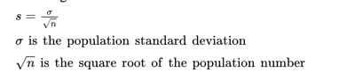
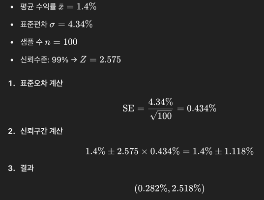
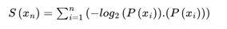
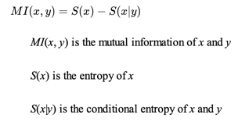

## Chapter 2. Essential Probabilistic Methods for Deep Learning (확률적 방법)
- 누구나 머신러닝과 딥러닝 알고리즘을 데이터 분석 및 최적화를 위해 활용하지만, **학습모델에 대한 제대로된 이해 없이는, 머신러닝을 제대로 이해할 수 없다.**

### A Primer on Probability (확률 개론)
- 머신러닝에서 중요한 확률은 중요하다.

#### Probability distribution functions(확률 분포 함수)
- 랜덤 변수의 다양한 결과를 볼 가능성은 확률 분포로 설명됩니다. 
- 머신러닝 기법에서 **확률 분포의 특징과 속성**을 이해하는 것이 필수적입니다. 
- 확률 분포 함수는 다양한 종류의 **시계열 데이터를 설명하는 데 사용**되며, 이는 적절한 알고리즘을 선택하는 데 도움을 줍니다. 
- 이 주제는 간단하고 일관성 있게 다루기 위해 제3장에서 설명됩니다.
````text
예시)
동전을 100번 던졌을 때 앞면이 나올 확률을 알고 싶다고 가정
이때 “앞면이 몇 번 나올까?”라는 질문에 답하기 위해 이항 분포를 사용할 수 있어요.
또 다른 예로, 사람들의 키를 측정한다면 많은 경우 정규 분포(벨 곡선) 형태로 분포됩니다.

-> 머신러닝에서는 이런 분포를 이용해 이상치를 탐지하거나, 모델 입력을 정규화하기도 합니다.
````

#### Hypothesis testing(가설 검정)
- 가설 검정은 데이터 샘플을 기반으로 모집단(population-based)에 대한 주장이 더 올바를지 틀릴지를 확립하는 데 사용
- 정상성 검정은 가설 검정을 사용하며 제3장에서 논의됩니다.
````text
예시)
한 공장에서 생산된 제품의 평균 무게가 1kg인지 확인하고 싶다고 가정

표본 30개를 뽑아 평균을 구했더니 0.95kg이 나왔다면,
“이 차이가 우연일까? 아니면 정말 평균이 1kg이 아닐까?”를 판단하기 위해 가설 검정을 사용

-> 머신러닝에서는 데이터를 사전에 분석할 때, 예를 들어 데이터가 정규분포를 따르는지를 테스트할 때 사용
````

#### Decision trees(의사결정 나무)
- 의사결정 나무는 **조건부 확률**과 같은 확률적 개념을 차용한 머신러닝 알고리즘의 일종입니다.
- 의사결정 나무에 대한 자세한 내용은 제7장에서 다룰 수 있습니다.
````text
예시)
고객이 대출을 상환할 수 있을지를 예측하려고 할 때,
“소득이 3천만 원 이상인가?”,
“직업이 정규직인가?”,
“과거 연체 이력이 있는가?” 같은 질문을 따라 나무처럼 분기하여 결정을 내려요.

-> 각 분기점에서 확률적으로 가장 유의미한 조건을 선택하기 때문에, 조건부 확률 개념이 활용
````
#### Information theory(정보 이론)
- 정보 이론은 정보가 어떻게 측정되고 저장되며 전달되는지를 연구하는 복잡한 학문입니다. 
- 의사결정 나무를 포함한 **수많은 머신러닝 기법에 통합**됩니다. 
- 제3장에서 다룰 최대 정보 계수라는 **비선형 상관 관계 측정 기법에도 사용**됩니다.
````text
예시)
메시지를 전송할 때 가장 압축률이 높은 방식으로 전달하려면, 어떤 문자가 자주 등장하는지 알아야 해요.
‘E’가 많이 나오는 영어 문장을 전송한다면, ‘E’를 짧은 코드로 압축하는 방식이 더 효율적이겠죠?

-> 이렇게 정보의 양을 수치화(엔트로피)하고, 정보의 손실 없이 전달하는 게 정보 이론입니다.
-> 머신러닝에서는 의사결정 나무에서 분기를 결정할 때, 또는 최대 정보 계수(MIC)로 변수 간 관계를 찾을 때 사용됩니다.
````

### Introduction to Probabilistic Concepts (확률 개념에 대한 소개)
#### Random Variable(랜덤 변수)
  - 확률 정보의 가장 기본 단위
  - 불확실한 수치나 결과
  - 예: 미래의 환율 수익률처럼 예측하기 어려운 사건을 모델링할 때 사용 (KRW/USD)
- 랜덤 변수의 종류
  - `이산형(discrete)`: 유한한 값만 가짐
    - ex) 주사위를 던진 결과 {1, 2, 3, 4, 5, 6}
  - `연속형(continuous)`: 어떤 구간 내의 모든 값
    - ex) EUR/USD의 일일 수익률

#### Probability Distribution(확률 분포)
- 랜덤 변수를 설명하는 함수로, 가능한 값 각각에 대한 확률을 부여
- 일반적으로 히스토그램을 이용해 시각화(3장에서 설명)
- 확률 값은 항상 0과 1 사이
  - 확률 0.5133은 51.33%의 가능성
- 주사위
  - 6면체 주사위에서 3이 나올 확률은, P(3) = 1/6 ≈ 0.167

#### 상호 배타성 (Mutual Exclusivity)
- 주사위를 던질 때 3과 4가 동시에 나올 수 없음
  - 서로 다른 사건들은 함께 일어날 수 없고, 이들의 확률을 더하면 1
> P(1) + P(2) + P(3) + P(4) + P(5) + P(6) = 1

#### 조건부 확률과 무조건 확률
- `조건부 확률` (P(A|B))
  - B 사건이 발생했을 때 A가 발생할 확률
  - 예: 고용 데이터가 좋을 때 금리 인상 가능성

- `조건이 없는 확률` (Unconditional probability)
  - 어떤 다른 사건에 의존하지 않는 확률
  - 예: 어떤 경제 지표와 상관없이 금리 인상 확률

#### 확률의 덧셈 및 곱셈 규칙
- 곱셈 규칙 (Joint Probability)
  - 두 사건 A와 B가 모두 발생할 확률
  - P(A∩B)=P(A∣B)×P(B)
- 덧셈 규칙 (Addition Rule)
  - A 또는 B가 일어날 확률
    - 서로 독립이 아닐 때:
      - P(A∪B)=P(A)+P(B)−P(A∩B)
    - 서로 배타적일 때 (둘이 동시에 일어날 수 없음):
      - P(A∪B)=P(A)+P(B)

#### 독립 사건 (Independent Events)
- 서로의 발생 여부가 영향을 주지 않음
  - 예: 동전을 두 번 던졌을 때 앞면이 나올 확률은 항상 0.5
  - 예: 동전 5번 던져 모두 앞면이 나올 확률, 3.125

#### 기대값 (Expected Value)
- 각 가능한 결과에 그 확률을 곱해서 모두 더한 값 -> 가중 평균
- 고용수치예측
  - 기대값: (300,000×0.1)+(400,000×0.3)+(500,000×0.5)+(600,000×0.1)=460,000

| 고용 증가치 (명) | 확률  |
| ---------- | --- |
| 300,000    | 0.1 |
| 400,000    | 0.3 |
| 500,000    | 0.5 |
| 600,000    | 0.1 |

> Note   
> - 확률은 랜덤 변수나 사건을 설명하며, 0~1 사이의 값입니다.
> - 사건 간 관계(조건부, 독립, 상호배타 등)에 따라 확률을 결합하는 방식이 달라집니다.
> - 기대값은 가능한 결과들의 확률 가중 평균입니다.

기대값은 가능한 결과들의 확률 가중 평균입니다.

### Sampling and Hypothesis Testing (샘플링 & 가설 테스트)

#### 샘플링(Sampling)
- 정의: 전체 집단(모집단)에서 일부를 선택해서 통계적 분석을 수행
- 목적: 전체를 다 조사하기 어려우므로 대표적인 일부만 뽑아 전체를 추정.

- **샘플링 방법**
  - `단순 무작위 추출` (Simple random sampling)
    - 모든 개체가 똑같은 확률로 선택됨.
  - `계층적 추출` (Stratified sampling)
    - 모집단을 그룹으로 나눈 뒤, 각 그룹에서 비율에 맞게 추출.
  - `군집 추출` (Cluster sampling)
    - 모집단을 여러 클러스터로 나눈 뒤, 몇 개 클러스터를 무작위 선택하여 전체 포함.
  - `체계적 추출` (Systematic sampling)
    - 고정된 간격(n번째마다)으로 선택.

> 머신러닝에서도 샘플링은 매우 중요

#### 샘플링 오류
- 샘플링은 완벽하지 않기 때문에 오류가 발생할 수 있다.
  - **샘플링 오류**(sampling error)란, 샘플의 통계치와 모집단의 실제 통계치 간의 차이입니다.
    - 예를 들어 **평균**(mean)은 대표적인 통계치입니다.
> 최소 샘플 크기: 통계적으로 의미 있는 추론을 하려면 최소 **30개 이상의 샘플**
#### 중심극한정리(Central Limit Theorem)
- 모집단의 분포가 무엇이든, 충분히 큰 표본(n >= 30)을 여러 번 추출하면 샘플 평균의 분포는 정규분포를 따른다.
  - 이로 인해 정규분포 기반의 가설 검정이 가능해짐.(정규분포는 종(bell) 모양의 대칭)
  - 이 정리는 가설 검정에 매우 유용하며, **신뢰구간**(confidence interval)과 함께 쓰입니다.

#### 신뢰구간
- 신뢰구간은 모집단의 모수가 존재할 것으로 **예상되는 값의 범위**
- 신뢰구간 계산
  - x±(reliability factor × stndaard error)
    - 샘플 평균(x)
    - 신뢰계수(Reliability Factor): 정규분포 기준값 (예: 95% → 1.96)
    - 표준오차(Standard Error)  
      - 
- 계산예시
  - 
  - 우리는 99% 확신을 가지고, 전체 시장의 평균 수익률이 0.282%에서 2.518% 사이에 있을 것이라고 말할 수 있다
#### 가설 검정(Hypothesis Testing)
- 목적: 작은 표본을 이용해 모집단에 대한 결론을 내리는 것.
  - 집단의 특성(모수)에 대해 두 개의 서로 경쟁하는 가설을 세운 다음, 표본 데이터를 이용해서 어느 쪽이 더 타당한지 판단하는 과정
  - **두 개의 주장(가설)**
    - 귀무가설 (Null Hypothesis)
    - 대립가설 (Alternative Hypothesis)

- 어떤 금융 분석가가 두 개의 포트폴리오를 비교하면서 위험도(변동성, volatility) 차이가 있는지 알고 싶어 함.
  - 귀무가설 (Null Hypothesis, H₀):
    - 두 포트폴리오의 변동성은 같다.
  - 대립가설 (Alternative Hypothesis, H₁):
    - 두 포트폴리오의 변동성은 다르다.


#### 가설 검정 절차
1) 두 시나리오(H₀ vs H₁)를 설정한다.
2) 표본 데이터를 사용해 test statistic(검정 통계량)을 계산한다. 
  - 예: 평균 차이 / 표준 오차
3) 기준선(임계값, critical value)과 비교한다.
  - 기준은 보통 정규분포 기반, 예를 들어 ±1.96 (95% 신뢰수준일 때)
4) 판단
  - 검정 통계량이 ±1.96 밖에 있다 → 귀무가설 기각 → 대립가설 채택
  - 검정 통계량이 ±1.96 안에 있다 → 귀무가설 기각 못 함 → "차이가 있다고 보기엔 증거 부족"

> "둘이 다를까?"라는 질문 → 샘플 데이터를 보고 수학적으로 판단 → 우연인지 아닌지 결정

#### 가설 검정에서 생길 수 있는 실수 (에러 2가지)
- Type I 오류 (1종 오류)
  - 사실은 차이가 없는데 → 있다고 판단함
  > 귀무가설은 맞는데, 잘못 기각한 경우
- Type II 오류 (2종 오류)
  - 사실은 차이가 있는데 → 없다고 판단함
  > 귀무가설은 틀렸는데, 잘못 유지한 경우

#### p-값(p-value)
- 귀무가설이 참일 때, 지금 얻은 데이터(혹은 그보다 더 극단적인 결과)가 나올 확률
- 지금 우리가 얻은 데이터가 귀무가설이 맞을 때는 거의 안 나올 정도로 이상한 데이터라면?
  - → p-value가 작다 → 귀무가설을 믿기 어렵다 → 기각!
- ex) 주사위를 10번 던졌는데, 6이 8번 나옴.
 - H₀: 주사위는 공정하다 (각 눈 나올 확률 1/6)
 - 관측된 결과: 6이 8번 나옴 
 - 계산해보니 그런 일이 일어날 확률 = p-value = 0.01 (1%) => 귀무가설 틀릴 가능성이 높다고 판단

### A Primer on Information Theory(정보 이론)
- 정보이론 : 확률과 밀접한 관련이 있는 추상 수학의 복잡한 분야
  - 정보가 어떻게 정량화되고, 저장되며, 전송되는지를 연구하는 학문
- 어떤 사건이 일어날 때는 세 가지 상황
  - 불확실성(Uncertainty)
  - Surprise
  - 정보(Information)

#### 정보이론의 핵심 개념 중 하나는 **엔트로피**(entropy)
- 메시지나 정보 출처에 있는 불확실성 또는 무작위성의 수준을 나타내는 개념
  - 예를 들어, 동전 던지기처럼 50% 확률의 사건은 예측이 어려워 엔트로피가 큽니다. 반면, 100% 확률의 사건은 이미 예측이 가능하므로 엔트로피가 0
- 공식
  - 
  - 각 사건의 정보량 × 확률의 평균값
#### information gain
- 새로운 정보를 받았을 때 **엔트로피가 얼마나 줄어드는지를 측정**
- 어떤 정보를 받았을 때 그 정보가 얼마나 우리의 예측을 돕는지, 즉 불확실성을 줄였는지를 측정
  - 흔히 변화 전과 후의 엔트로피 차이로 계산

#### 상호정보량 (Mutual Information)
- 상호정보량은 두 변수 사이의 불확실성 감소 정도를 측정
  - 공식
    - 
    - S(x): x의 엔트로피 , S(x∣y) : y를 알고 있을 때의 x의 조건부 엔트로피
      - y를 알면 x에 대한 불확실성이 얼마나 줄어드는가?
      - 값이 0이면 독립적인 변수, 값이 클수록 의존성이 크다