##### 55~68p
##### meaussre of shape 68 ~

## Chapter 3. Descriptive Statistics and Data Analysis (기술통계와 데이터 분석)
- `Descriptive statistics`(기술 통계)
  - 데이터를 설명하고, 그로부터 가능한 한 많은 정보를 추출하는 분야
  - 기술통계는 데이터의 경향, 행동, 추세를 요약하기 때문에 **데이터를 대표하는 역할**
    - 데이터를 대표할 수 있는 통계치를 통해 전체 데이터를 이해
- `트레이딩`과 `분석`에서는 기술통계에서 사용되는 다양한 지표들을 많이 차용
  - 예를들어, 경제 시계열 예제 **소비자물가지수**(CPI)
    - `비자물가지수(CPI)`는 도시 소비자들이 매달 구매하는 선택된 상품과 서비스의 가격을 측정
    - 매달 새로운 수치가 발표되어 연속적인 시계열 데이터를 형성
    - 어떤 두 시점 간의 **인플레이션율**은 물가지수의 백분율 변화를 통해 측정
    - CPI는 전년 대비 기준으로 발표, 이는 현재 월간 수치와 12개월 전의 수치 간 차이로 보고
- `CPI의 연간 변화율`은 인플레이션의 일반적인 추세를 나타내는 지표로 사용
### Measures of Central Tendency (대표값)
- **중심 경향성(Central Tendency)** 
  - 데이터 집합을 대표할 수 있는 `하나의 값으로 요약`하는 통계 지표
  - 평균은 값들의 총합을 항목 수로 나눈 것으로, 해당 데이터 집합을 가장 잘 대표하는 값

- [**평균**] 
- 데이터셋 A와 B의 평균(mean)을 계산예제
  - 데이터셋 A = [1, 2, 3, 4, 5] : 3
  - 데이터셋 B = [1, 1, 1, 1] : 1

- [그림 3-1] 2003년부터 미국 CPI 지수  
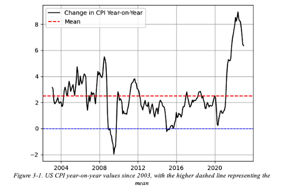
  - 상단의 점선은 2003년 이후의 월간 평균치
  - 하단의 점선은 0
  - 0 아래에 있는 구간들은 디플레이션(물가 하락) 기간

- [**중앙값**]
  - 중앙값(median): 데이터를 크기순으로 정렬했을 때 정중앙에 위치한 값
  - 짝수 개일 때 중앙값 계산법:
    - 정렬된 데이터에서 두 가운데 값의 평균이 중앙값
    - 데이터셋 A = [1, 2, 3, 4, 5] = 3
  - 홀수 개일 때 중앙값 계산법:
    - 정렬된 데이터에서 가운데 위치한 값이 중앙값
    - 데이터셋 B = [1, 2, 3, 4] = 2.5

- [**최빈값(mode)]
  - 최빈값은 데이터에서 가장 자주 관측되는 값을 의미
    - 데이터 분석에서는 가장 덜 사용되는 편
  - 데이터셋 A = [1, 2, 2, 4, 5] => 2가 최빈값
  - 데이터셋 B = [1, 2, 3, 4] => 최빈값이 없음
  - 데이터셋 C = [1, 1, 2, 2, 3] => 1,2 2개씩 등장, 다중 최빈값

> Note:
>   최빈값은 연속형 변수(예: 가격, 수익률 시계열)보다는 신용 등급 같은 **범주형 변수**(categorical variables)에서 더 유용

### Measures of Variability (변동성 지표)
- 변동성 지표
  - 변동성 측정치는 데이터셋 **내 값들이 중심 경향성(주로 평균) 대비 얼마나 퍼져 있는지**를 설명
  - 가장 잘 알려진 변동성 측정치는 분산(variance)

- [분산]
  - 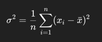
    - 각 데이터 점이 평균에서 떨어진 거리(편차)를 제곱한 값들을 모두 더한 후, 그 편차들의 평균을 계산
  - 데이터셋 A = [1, 2, 3, 4, 5]
    - 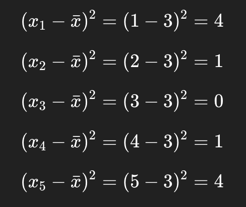
    - 총합을 관측치 개수인 5로 나눔 10/5
    - 정답 : 2
  - 데이터셋 B = [5, 5, 5, 5]
    - 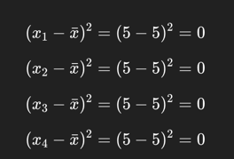
    - 총합을 관측치 개수인 4로 나눔 0/4
    - 정답 : 0
  - **분산**의 `단점`
    - 분산(variance)은 제곱된 값을 사용, `평균`(mean)과 단위가 달라 **직접 비교할 수 없다**
    - but, **분산의 제곱근을 취함으로써 쉽게 해결**

- [표준편차]
  - 표준편차는 **분산의 제곱근**
  - `데이터 값들이 평균으로부터 얼마나 떨어져 있는지를 평균적으로 나타낸 값`
- 표준편차 해석 방법
  - 표준편차가 낮다: 대부분의 값들이 평균에 가깝게 분포 → **변동성(Volatility)이 낮다.**
  - 표준편차가 높다: 값들이 평균에서 많이 흩어져 있음 → 변동성이 크다.
  - 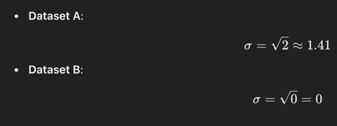
> **Note**
>   표준편차(Standard deviation)와 변동성(Volatility) 같은 의미로 사용, 서로 동의어

- `표준편차`는 더 자주 사용된다.
  - 평균과 같은 단위를 사용하기 때문에, 함께 쓰기에 더 유용
  - 정규분포(normal distribution)에서 중요하게 사용

> 표준편차는 데이터가 평균에서 얼마나 흩어져 있는지를 나타내는 지표

- [범위]
  - 범위는 데이터셋에서 **가장 큰 값**과 **가장 작은 값**의 `차이`
    - Range = max(x) − min(x)

### Measures of Shape(분포의 형태)
- 형태(Shape)의 측정 지표는 대표적으로 2가지
  - 왜도(Skewness)
  - 첨도(Kurtosis)

- Measures of Shape
  - 데이터셋에서 중심경향치(Central tendency)를 기준으로 값들이 어떻게 분포되어 있는지를 설명
    - *중심경향치 : 데이터 분포의 중심을 보여주는 값
  - 평균(mean)과 표준편차(standard deviation)는 정규 분포(normal distribution)를 설명하는 두 가지 요소
    - 평균 : 분포의 중심을 나타냄
    - 표준편차 : 데이터의 퍼짐이나 산포(spread or dispersion)를 나타냄
  - `확률 분포(probability distribution)`
    - 무작위 실험에서 다양한 결과나 사건이 발생할 가능성을 설명하는 수학적 함수
    - 어떤 확률 변수(random variable)가 가질 수 있는 모든 값에 대한 확률을 제공
    - 확률 분포의 대표적인 2가지
      - `이산 분포(discrete distribution)`
        - 이산 분포는 **유한한 수의 값**을 가진다.
        - ex) 베르누이 분포(Bernoulli distribution), 이항 분포(binomial distribution), 포아송 분포(Poisson distribution) 
      - `연속 분포(continuous distribution)`
        - **주어진 범위** 내에서 임의의 값을 가질 수 있는 확률 변수에 사용
        - ex) 정규 분포(normal distribution) - 대칭적이며 종 모양, 정규 분포는 통계 분석에서 가장 널리 사용되는 분포

> **Note**  
>   - 자연 현상이나 사람들의 행동 등에서 수집한 데이터는 종종 정규분포를 따른다.  
>   - 대부분의 통계 기법(예: t검정, 회귀 분석 등)은 데이터가 정규 분포를 따른다고 **전제**  
>   - 금융 수익률은 정규 분포와는 약간 다르다
>     - 왜도: 분포가 한쪽으로 치우쳐 있는 정도
>     - 첨도: 극단적인 값(꼬리 부분)이 얼마나 자주 나타나는지
>   - 금융 수익률이 완벽히 정규 분포는 아니지만, 통계 모델에서는 여전히 정규 분포라고 단순화해서 가정하는 경우가 많다.

- 정규 분포에서는 데이터가 평균을 중심으로 대칭적으로 분포
  - 평균이 중앙값(중위수) 및 최빈값(mode)과 같다는 것을 의미
    - 평균(Mean) : 모든 값을 더해서 개수로 나눈 값 (산술 평균)
    - 중앙값 (Median) : 데이터를 크기 순으로 정렬했을 때 한가운데 값
    - 최빈값 (Mode) : 가장 자주 등장하는 값
  - 정규 분포의 특징
    - 전체 데이터의 약 68%는 평균에서 ±1 표준편차 이내에, 약 95%는 ±2 표준편차 이내에, 약 99.7%는 ±3 표준편차 이내에 위치
    - 이러한 특성 덕분에 정규 분포는 통계적 추론에 있어 `유용한 도구`

- **Measures of Shape (분포의 형태를 설명하는 척도)**  
  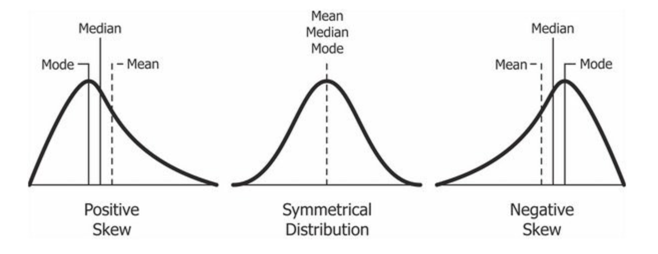  
  - `왜도(Skewness)`
    - 분포의 비대칭성을 나타내며, 분포가 얼마나 대칭에서 벗어났는지를 분석
    - ex) 정규 분포의 왜도는 0, 이는 평균을 기준으로 양쪽에 데이터가 동일하게 분포되어 있다는 뜻
  - `양의 왜도(Positive skew)`
    - 분포의 오른쪽 꼬리가 길다는 것을 의미
    - 평균이 중앙값보다 크며, 평균은 이상치(outlier)에 민감하기 때문에 값이 높아져 오른쪽으로 치우친다.
  - `음의 왜도(Negative skew)`
    - 분포의 왼쪽 꼬리가 길다는 것을 의미
    - 평균이 중앙값보다 작으며, 최빈값은 세 가지 중심 경향성 지표 중 가장 큰 값

> **Note**  
> - 금융 시장에서 왜도(skewness)는 어떻게 해석될 수 있을까?
>   - 양의 왜도 : 평균보다 높은 수익이 평균보다 낮은 수익보다 더 많다 (몇몇 아주 높은 수익이 평균을 위로 올린 상황)
>   - 음의 왜도 : 평균보다 낮은 수익이 더 많다(극단적인 큰 손실 때문에 평균이 크게 내려간 상황)

#### **왜도(skewness)**
  - 공식
    - 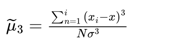  

- CPI 왜도(skewness)
  - 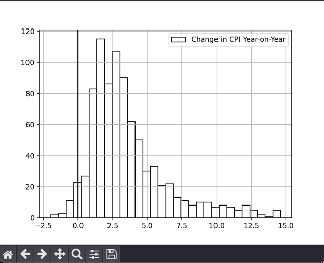 
    - 왜도(skewness)는 확률 분포의 **비대칭성을 측정**하는 지표(분포가 정규 분포에서 얼마나 벗어나는지를 나타냄)
  - 왜도가 –0.5에서 0.5 사이이면, 데이터는 대칭적
  - 왜도가 –1.0에서 –0.5 사이 또는 0.5에서 1.0 사이이면, 데이터는 약간 비대칭적(mildly skewed)
  - 왜도가 –1.0 미만이거나 1.0 초과이면, 데이터는 심하게 비대칭적(highly skewed)

> **Note**  
>   - 비대칭 분포에서는 평균이 이상치에 의해 영향을 많이 받아 왜곡될 수 있기 때문에, 중앙값(median)을 사용하는 것이 더 적절할 수 있다.

#### **첨도(kurtosis)**
  - 정의 : 첨도는 `정규 분포를 기준`으로 **분포의 봉우리 정도**(peakedness)나 **평평함**(flatness)을 설명하는 개념
  - 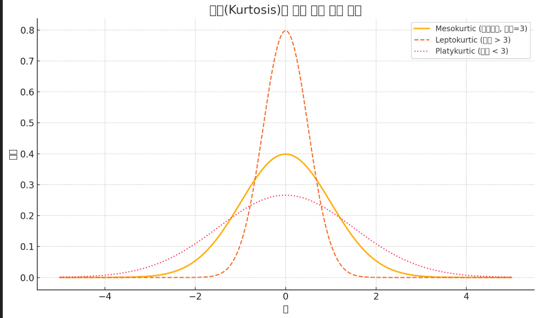   
  
    | 첨도 값 | 분포 유형                | 설명                            |
    | ---- | -------------------- | ----------------------------- |
    | > 3  | 레프토쿠르틱 (Leptokurtic) | 봉우리가 뾰족하고 꼬리가 두꺼움 → 극단값 가능성 큼 |
    | = 3  | 메소쿠르틱 (Mesokurtic)   | 정규 분포                         |
    | < 3  | 플라티쿠르틱 (Platykurtic) | 봉우리가 낮고 평평하며 꼬리가 얇음           |

  - 공식
    - 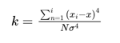 
    - 첨도는 **초과 첨도**(excess kurtosis)로 측정되기도 한다.
      - 정규 분포의 기준값 3을 빼서 0을 기준점으로 맞추는 방식
      - `초과 첨도 = 첨도 – 3 으로 계산`
    - ex) 미국 소비자물가지수(CPI)의 전년 대비 데이터를 가지고 초과 첨도 계산
      - 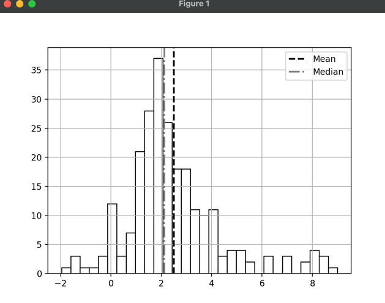  
        - 양(+)의 첨도 값은 정규분포보다 더 뾰족한 분포를 나타냄,
        - 음(–)의 첨도는 정규분포보다 더 평평한 형태를 나타냄.
      - 2.16xxx => 극단적으로 높거나 낮은 CPI 값이 빈번하게 등장할 가능성이 높은 분포
      - 보통은 안정적이지만, 예외적으로 큰 물가 급등/급락이 가끔 있다는 뜻

> 인플레이션 이해하기 (Understanding Inflation)
>  - 인플레이션(Inflation)
>    - 경제 주체(예: 가계)의 구매력 감소를 의미 => 전반적인 물가 상승
>  - Deflation (디플레이션)
>    - 인플레이션 수치가 음수(–)일 때를 디플레이션
>  - Stagflation (스태그플레이션)
>    - 물가는 상승, 경제 성장률은 둔화되고 실업률은 높은 상태를 유지
>  - Disinflation (디스인플레이션)
>    - 인플레이션이 감소하지만 여전히 양수(+)인 상태
>  - Hyperinflation (초인플레이션)
>    - 인플레이션이 통제 불능 상태, 물가 상승률이 수백만 퍼센트 수준까지 치솟는 경우

#### 분위수(Quantiles)
  - 분위수는 `형태(shape)와 산포도(variability)`, 두 가지를 모두 **측정할 수 있는 지표**
    - **형태(shape)**: 값들이 분포된 방식
    - **산포도(variability)**: 값들이 얼마나 흩어져 있는지
- 가장 많이 사용되는 분위수: 사분위수(Quartiles)
  - `사분위수(quartiles)`는 데이터를 네 개의 동일한 부분으로 나눈다.
    - 데이터를 크기순으로 정렬한 다음, 해당 위치에서 데이터를 분할
- 사분위수의 분할 방식 `Tukey의 힌지(Tukey’s hinges) 방법` 예시(예시 데이터 : 1,2,4,5,7,8,9), 
  - Q1 (하위 사분위수): 전체 데이터 중 1/4 지점에 해당 → 이 경우 2
  - Q2 (중간값 / 중앙 사분위수): 전체의 1/2 지점, 즉 중앙값 → 이 경우 5
  - Q3 (상위 사분위수): 전체 데이터 중 3/4 지점에 해당 → 이 경우 8
  - **사분위수 계산 공식**
    - 몇 번째 항인지(순서)를 알려줌
      - Q1 위치 = (n+1)/4 → 값은 2
      - Q3 위치 = 3(n+1)/4 → 값은 8
        - Q1과 Q3 사이의 거리를 구하면 → 데이터 중간 50%가 얼마나 퍼져있는지를 알 수 있다.
  - **IQR (사분위 범위, Interquartile Range)**
    - IQR = Q3 – Q1 (8 – 2 = 6)
      - IQR = 6 의 의미, 데이터 중간 50%가 6만큼 퍼져 있다는 뜻이에요.
      - 다시 말해, 중앙 4개의 데이터(데이터 7개 중 가운데 50%)가 2에서 8 사이에 분포되어 있음
    - **IQR?** 이상치 영향 적고 변동성 평가에 좋음
      - IQR은 전체 데이터 중 중간 50%의 퍼짐 정도를 나타낸다.
      - IQR은 극단값(이상치)에 강인한 지표
      - IQR는 데이터의 중앙 분포의 변동성, 혹은 위험도 측정에 널리 사용
    

> **⚠️ 사분위수 계산법 주의사항**
>   - 사분위수를 계산하는 방식은 여러 가지 방법이 존재
>   - 같은 데이터라도 방식에 따라 결과가 다를 수 있다.
>   - 따라서, 분석 전반에서 **같은 계산 방식을 일관되게 사용**

> **Note**
>  - 정규분포 (Normal Distribution)
>    - 연속 확률분포 중 하나로, 종 모양(bell curve)
>    - 데이터가 평균 주변에 많이 몰려
>    - 평균(mean), 중앙값(median), 최빈값(mode)이 모두 같다.
>  - 왜도 (Skewness)
>    - 확률분포의 비대칭성(좌우 치우침)을 나타내는 척도
>    - 왜도가 0이면 완전 대칭(정규분포)
>    - 양수면 오른쪽으로 꼬리가 길고
>    - 음수면 왼쪽으로 꼬리가 긴 분포
>  - 첨도 (Kurtosis)
>    - 확률분포의 뾰족함(peakness)을 나타낸다.
>    - 특히, 초과첨도(excess kurtosis)를 많이 쓴다.
>    - 초과첨도가 0이면 정규분포와 비슷한 뾰족함을 가졌다는 뜻
>  - 분위수 (Quantiles)
>    - 정렬된 데이터를 같은 크기의 구간으로 나누다.
>    - 가장 많이 쓰이는 분위수는 사분위수(quartiles)로 데이터를 4등분
>  - 사분위 범위 (IQR, Interquartile Range)
>    - 제3사분위수(Q3)와 제1사분위수(Q1)의 차이
>    - 이상치(outlier)에 영향을 받지 않아 데이터 분석에서 매우 유용

### Visualizing Data
- 데이터를 시각화할 때는 여러 가지 `통계적 그래프(statistical plots)` 자주 사용
- 대표적인 시각화 기법
  - `산점도(Scatterplot)`
    - **두 변수 간의 관계**를 `점`으로 나타내는 그래프
    - 각각의 점은 **두 변수 값이 만나는 지점(교차점)**을 나타냄
    - 즉, 하나의 점은 x축 변수와 y축 **변수 간의 쌍**(pair)을 의미
    - 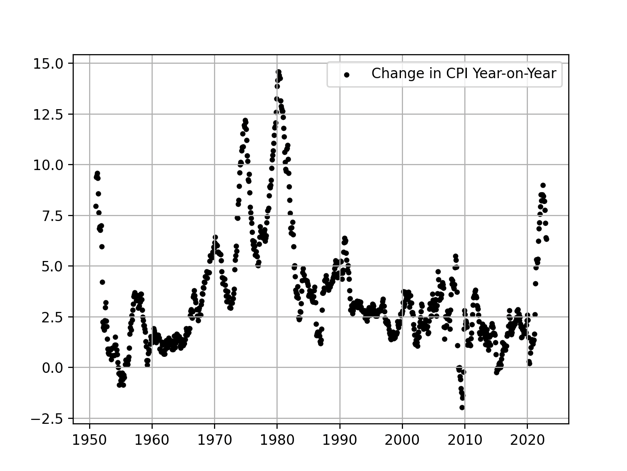 
      - CPI 데이터가 y축, 그리고 시간이 x축
      - 일반적으로 산점도는 서로 다른 두 변수 간의 관계를 비교할 때 더 자주 사용
      - **시간 변수를 제거하면 더 많은 인사이트를 얻을 수 있는** 경우가 많다.
    - 영국의 연간 CPI 변화율(UK CPI year-on-year change)과 미국의 연간 CPI 변화율(US CPI year-on-year change)을 비교
      - 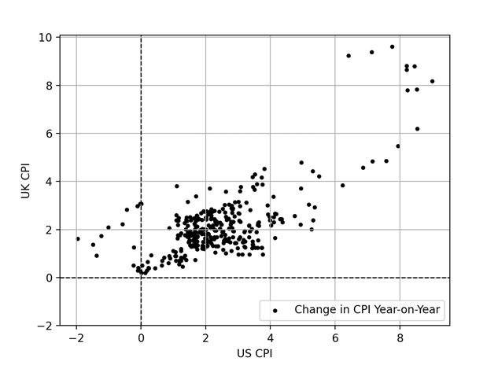 
      - 두 변수 사이에 양(+)의 상관관계, 한 국가의 CPI가 높을수록 다른 국가의 CPI도 높은 경향이 있는 것 ==> 이러한 관계를 **상관관계** 라 칭한다.

#### 산점도(Scatterplot)
- 산점도는 `데이터 간의 상관관계를 시각화`할 때 매우 유용
  - 그리기도 쉽고 해석도 간단
  - 일반적으로 점들이 대각선 방향으로 위로 올라가는 선을 그릴 수 있을 정도로 흩어져 있다면, 그 상관관계는 **양(+)의 상관관계**
  - 변수들을 나타내는 점들 사이에 대각선 방향으로 아래로 내려가는 선을 그릴 수 있다면, **음(-)의 상관관계**

#### 선 그래프(Line plots)
- 선 그래프(Line plots)는 가장 기본적인 형태의 그래프
  - **산점도**(scatterplot)의 점들을 `선으로 연결한 것`
- 선 그래프의 장점
  - `단순함`과 `구현의 용이성`
  - 시간에 따라 **데이터의 변화 추이**(evolution)를 보여주기 때문에, `추세(trend)`나 `패턴(pattern)`을 식별하는 데 도움
- 1951년 이후 미국 소비자물가지수(CPI) 데이터에 대한 기본적인 선 그래프
  - 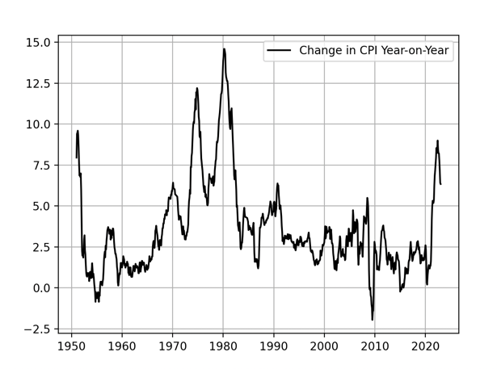  

#### 막대 그래프(bar plots)
- 막대 그래프는 **시간 축**(x축)에 따라 그려진다
- 막대 그래프는 변수(일반적으로 `범주형 변수`)의 분포를 시각화하는 데 사용
  - 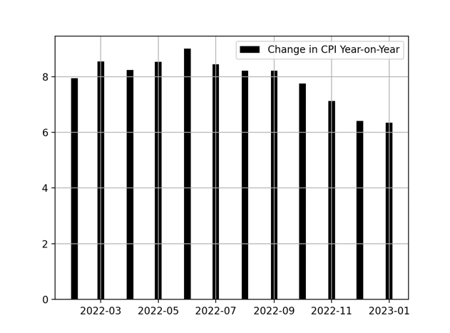  
- 막대 그래프는 연속형 데이터(예: CPI나 주가)를 시각화할 때 한계가 있다.
  - 축의 스케일(scale)이 잘못 설정되면 오해를 유발한다.
  - 데이터가 많을 경우 시각이 복잡해지기 때문에 `큰 데이터셋에는 적합하지 않다.` ==> 이러한 경우에는 **히스토그램**(histogram)이 더 나은 선택

#### 히스토그램(histogram)
- **히스토그램은 시간 축이 없다.**
  - 히스토그램은 단순히 값들의 집합을 바탕으로 `전체 분포의 형태를 보여주기 위해` 그려지는 것
- **연속형 데이터의 빈도 분포**(frequency distribution)를 시각화하는 데 사용한다.
- 히스토그램은 각 **계급 구간**(class/bin)에 몇 개의 관측값이 포함되어 있는지를 막대를 통해 보여준다.
  - 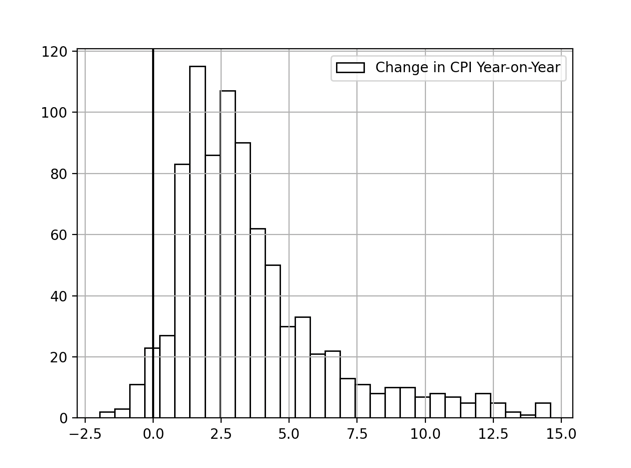  

#### 박스 플롯(Box and Whisker Plot, 상자 수염 그림)
- `연속형 변수의 분포를 시각화`하는 데 사용한다.
  - **중앙값**(median)과 **사분위수**(quartiles), 그리고 **이상치**(outliers)도 함께 포함된다.
  - 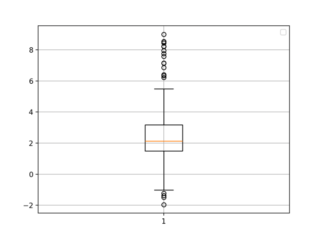  
- 박스 플롯을 해석하는 방법
  - `상자`(box)는 `IQR`(Interquartile Range, 사분위 범위)을 나타낸다.
    - 상자는 `1사분위(Q1)`와 `3사분위(Q3)` 사이에 그려진다.
    - 상자 안의 선은 `중앙값`(median)을 나타낸다.
    - `수염`(whiskers)은 상자의 위쪽과 아래쪽에서 `최댓값`과 `최솟값` 방향으로 뻗어나간다.
      - 수염은 IQR의 1.5배 범위 내의 값까지만 포함한다.
      - 이 범위를 벗어난 값들은 `이상치`(outliers)로 간주되며, 그래프에서는 `개별 점으로 표시`
  - 이상치(박스의 양 끝에서 박스 길이의 1.5배를 초과하는 값)를 제외하고도 데이터를 시각화가능
    - 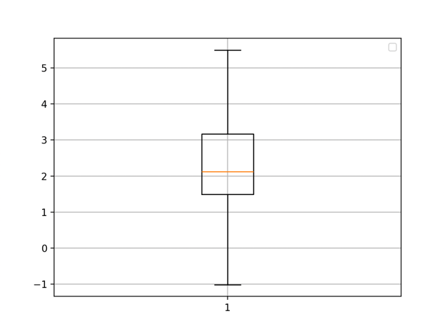    
- `데이터 시각화 기법`에는 **히트맵**(주로 상관관계 데이터나 온도 분포 시각화에 사용)과 **원형 차트**(예산 분배나 시장 세분화에 자주 사용)처럼 매우 다양한 방법들이 있다.
  - `어떤 시각화 기법을 사용할지`는 당신이 이해하려는 **내용과 요구에 가장 적합한 방법**에 따라 다르다.
    - `선형 그래프`는 하나의 특성만 있는 시계열 데이터(예: 특정 종목의 종가)에 더 적합
    - `히스토그램`은 확률 분포 데이터를 시각화할 때 더 적합

> **NOTE**
> - 어떤 시각화 기법을 사용할지는 분석 및 해석의 목적에 따라 결정해야 한다.
> - 특정 플롯은 특정 데이터 유형에 더 적합.
> - 시각화는 수치적으로 확인하기 전, 초기 해석에 도움을 준다.
> - 금융 시계열 데이터를 다룰 때는 선형 그래프(line plots)와 캔들스틱 차트(candlestick plots)를 사용할 가능성이 높다.

### Correlation

### The Concept of Stationarity