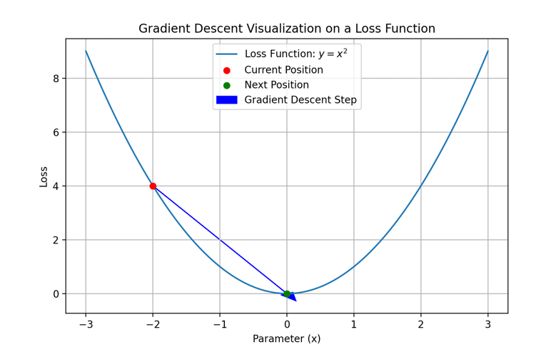
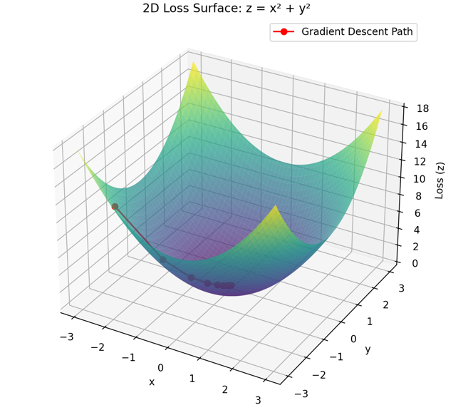
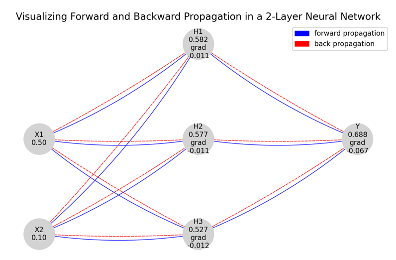

### Linear Programming(선형 계획법)
- 수학적 최적화 기법
- 현실의 숫자와 조건을 `변수와 계수로 정리`해서 **수학 모델로 표현**하는 게 선형계획법의 핵심
- `목적함수`를 **최대화** 또는 **최소화**하는 문제를 해결하는 방법
- 활용 분야: 물류, 생산 계획, 인력 배치, 재무 계획, 에너지 최적화 등.

#### Linear Programming 구성 요소
| 구성 요소                             | 설명                                    |
| --------------------------------- | ------------------------------------- |
| **목적 함수 (Objective Function)**    | 최대화 또는 최소화하고자 하는 식<br>예: 최대 이익, 최소 비용 |
| **의사 결정 변수 (Decision Variables)** | 목적 함수와 제약 조건을 구성하는 변수<br>예: x = 생산량   |
| **제약 조건 (Constraints)**           | 자원, 규칙, 물리적 제한 등 문제에 주어진 조건들          |
| **비음수 조건 (Non-negativity)**       | 대부분의 경우 변수는 0 이상이어야 함<br>예: x ≥ 0     |

#### Linear Programming 문제 예시
````text
- 두 제품 A, B를 생산하는 공장이 있다고 가정 
  - A 1개당 이익: 40만원
  - B 1개당 이익: 30만원
- 작업 시간 제한: 총 100시간
- A는 2시간 필요, B는 1시간 필요
- 자재 제한: 총 80kg 
  - A는 1kg 필요 
  - B는 2kg 필요
````
- **의사 결정 변수 선정**
  - `x = A의 생산량`
  - `y = B의 생산량`
- **목적 함수 (최대 이익)**
  - Maximize Z = 40x + 30y
- **제약 조건**
  - `작업 시간`: 2x + y ≤ 100시간
  - `자재`: x + 2y ≤ 80kg
  - 비음수 조건: x ≥ 0, y ≥ 0

#### 🎯 딥러닝에서 최소화 문제란?
- 딥러닝에서 우리가 최적화하려는 대상은 대부분 **손실 함수(loss function)**

#### ✅ 해결 방법: Gradient Descent
1. 경사 하강법 (Gradient Descent)
   - `손실 함수`의 **기울기**(gradient)를 계산해서, 현재 위치에서 손실을 가장 빠르게 줄일 수 있는 방향으로 **파라미터를 업데이트**
   - **매 스텝마다 기울기 방향으로 이동하면서 손실을 줄여나감**
- 
- 
2. 역전파 (Backpropagation)
- 
  - 입력 계층 (Input Layer): X1, X2 두 개의 입력 노드(0.50과 0.10의 초기 값)
  - 은닉 계층 (Hidden Layer): H1, H2, H3 세 개의 은닉 노드
  - 출력 계층 (Output Layer): Y라는 하나의 출력 노드
#### 💡 수십억 차원도 가능한 이유는?
- CPU나 GPU에서 벡터/행렬 연산이 빠르게 돌아가도록 최적화
- 전체 손실 함수에서 중요한 정보만을 쏙쏙 뽑아내는 `확률적 경사하강법(SGD, mini-batch)` 같은 방식을 사용